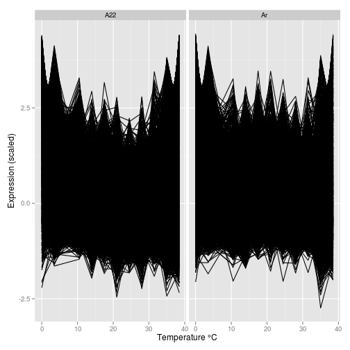
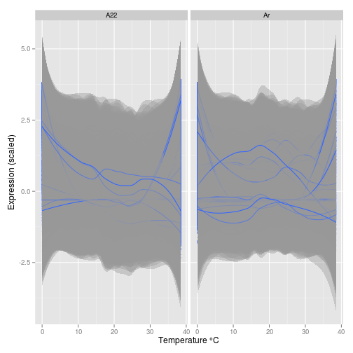
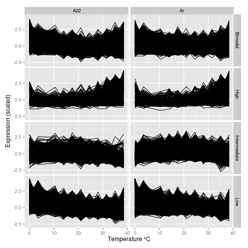
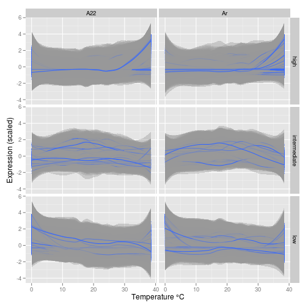
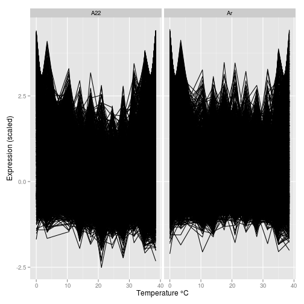
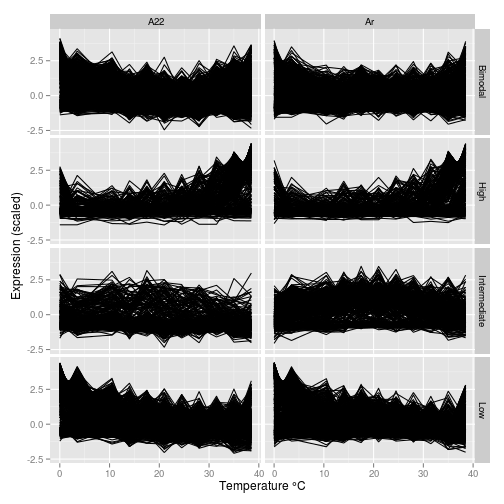
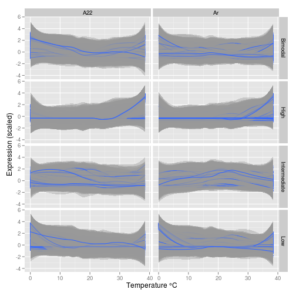

Thermal reactionome of the common ant species *Aphaenogaster*
================================================================
  
**Author:** [John Stanton-Geddes](john.stantongeddes.research@gmail.com)

**February 10, 2014**

**Technical Report No. 3**

**Department of Biology**

**University of Vermont**


## Summary ##
  
In this technical report, which accompanies the manuscript **Thermal reactionome of a common ant species** (Stanton-Geddes et al., in press), we:

1. describe the *de novo* assembly of the transcriptome for two ant colonies with in the *Aphaenogaster rudis-picea-fulva* species complex (<a href="http://dx.doi.org/10.1155/2012/752815">Lubertazzi, 2012</a>)
2. identify thermally-responsive genes
3. perform gene set enrichment analysis

This script is completely reproducible assuming that R, `knitr` and the other required libraries (listed within the source document) are installed on a standard linux system using the following:
    
    Rscript -e "library(knitr); knit('ApTranscriptome_TR.Rmd')"

The assembled transcriptome, annotation and expression values are downloaded rather than re-run due to the computational demands, but the exact commands for each of these steps are documented below.

## Data ##

The raw Illumina fastq files are available from [https://minilims1.uvm.edu/BCProject-26-Cahan/_downloads/trimmomatic_output.tar.gz]

We download and unzip the Trimmomatic filtered data available from [https://minilims1.uvm.edu/BCProject-26-Cahan/_downloads/trimmomatic_output.tar.gz]

~~~
# download
wget --no-check-certificate https://minilims1.uvm.edu/BCProject-26-Cahan/_downloads/trimmomatic_output.tar.gz

# move and unzip
mv raw_data.tar.gz data/.
tar -zxvf raw_data.tar.gz
~~~


```r
### Download

### Expression data

### Annotation file from either AWS or GoogleDrive
annotationURL <- getURL("http://johnstantongeddes.org/assets/files/Aphaeno_transcriptome_AnnotationTable.txt")
# a2 <- getURL('https://googledrive.com/host/0B75IymziRJ_9Tlg1U1Vxbjk1bzg')
# # GoogleDrive link

annotationfile <- read.csv(textConnection(annotationURL), header = TRUE, sep = "\t", 
    stringsAsFactors = FALSE)
head(annotationfile)
str(annotationfile)

# Convert to data.table
annotationtable <- data.table(annotationfile)
head(annotationtable)
```


## Sample description ##

Two ant colonies were used for the transcriptome sequencing. The first, designated A22, was collected at Molly Bog, Vermont in August 2012 by Nick Gotelli and Andrew Nguyen. This colony was putatively identifed as *A. picea*. The second colony, designated Ar, was collected by Lauren Nichols in Raleigh, North Carolina. These colonies were maintained in the lab for 6 months prior to sample collection. 

For each colony, three ants were exposed to one of 12 temperature treatments, every 3.5C ranging from 0C to 38.5C, for one hour in glass tubes in a water bath. The ants were flash frozen and stored at -80C until RNA was extracted using a two step extraction; [RNAzol RT](http://www.mrcgene.com/rnazol.htm) (Molecular Research Center, Inc) followed by an [RNeasy Micro](http://www.qiagen.com/products/catalog/sample-technologies/rna-sample-technologies/total-rna/rneasy-micro-kit) column (Qiagen). Samples from each colony were pooled and sequenced in separate lanes on a 100bp paired-end run of an Illumina HiSeq at the University of Minnesota Genomics Center, yielding 20e6 and 16e6 reads for the A22 and Ar samples, respectively.

## Transcriptome assembly ##

The Illumina reads were filtered using the program [Trimmomatic](http://www.usadellab.org/cms/?page=trimmomatic) (<a href="http://dx.doi.org/10.1093/nar/gks540">Lohse et al. 2012</a>) to remove Ilumina adapter sequences and filter out bases with quality scores less than ??. 

~~~
TRIMMOMATIC CODE
~~~

This filtering yielded...

These reads were combined and used in *de novo* transcriptome assembly using the program [Trinity](http://trinityrnaseq.sourceforge.net/) (<a href="http://dx.doi.org/10.1038/nbt.1883">Grabherr et al. 2011</a>). Note that this required ??? GB RAM and ??? hours run-time and was run on the [Vermont Genetics Network](http://vgn.uvm.edu/) computing cluster. 

~~~
TRINITY CODE
~~~

This assembly contained 100,381 unique components (roughly genes) in 126,172 total transcripts (Table 1). 

As we were assembling two divergent colonies into a single transcriptome, we suspected that this assembly would be susceptible to known problems of errors during assembly (e.g. chimeric transcripts that are fusions of two transcripts) and redundancy (<a href="http://dx.doi.org/10.1186/1471-2164-14-328">Yang & Smith, 2013</a>). To account for this, we performed two post-assembly processing steps.

First, we ran the program [cap3](http://seq.cs.iastate.edu/) (<a href="http://dx.doi.org/10.1101/gr.9.9.868">Huang, 1999</a>) setting the maximum gap length and band expansion size to 50 `-f 50 -a 50`, no end clipping as the reads were already filtered `k 0`, requiring 90% identity for assembly, and a minimum overlap length of 100 bp `-o 100`. The percent identity threshold of 90% was chosen to liberally collapse orthologous contigs from the two colonies that may have been assembled separately. 

    cap3 Trinity.fasta -f 50 -a 50 -k 0 -p 90 -o 100 > Trinity_cap3.out

The output of `cap3` gives assembled "contigs" and unassembled "singlets" that were concatenated into a single file.

    # check the number of contigs clustered
    grep -c "Contig" Trinity.fasta.cap.contigs
    grep -c "comp" Trinity.fasta.cap.singlets
    # compare to contigs from Trinity output
    grep -c "comp" Trinity.fasta

    # Combine contigs and singlets from CAP3
    cat Trinity.fasta.cap.contigs Trinity.fasta.cap.singlets > Trinity_cap3.fasta

The output file "Trinity.fasta.cap.info" gives specific information on which contigs were collapsed.

Subsequent to running `cap3`, we ran [uclust](http://drive5.com/usearch/manual/uclust_algo.html) to cluster sequences completely contained within longer sequences, again specificing a 90% identity cutoff for clustering. 

    # sort
    uclust --sort Trinity_cap3.fasta --output Trinity_cap3_sorted.fasta
    # cluster by 90% similarity threshold
    uclust --input Trinity_cap3_sorted.fasta --uc Trinity_cap3_uclust.out --id 0.90
    # convert uclust to fasta format
    uclust --uc2fasta Trinity_cap3_uclust.out --input Trinity_cap3_uclust.fasta


These post-processing step removed 16% of the initial reads (Table 1).


|    &nbsp;     |  Total contigs  |  Total length  |  Median contig size  |
|:-------------:|:---------------:|:--------------:|:--------------------:|
|  **trinity**  |     126,172     |  100,389,539   |         358          |
|  **reduced**  |     105,536     |   62,648,997   |         320          |

Table: Table 1: Statistics for Trinity and cap3+uclust reduced transcriptome assemblies (continued below)

 

|    &nbsp;     |  Mean contig size  |  N50 contig  |  N50 Length  |
|:-------------:|:------------------:|:------------:|:------------:|
|  **trinity**  |        795         |    16,201    |    1,631     |
|  **reduced**  |        593         |    15,491    |     895      |


## Transcriptome annotation ##

Annotation was performed by uploading the reduced assembly "Trinity_cap3_uclust.fasta" to the web-based annotation program [FastAnnotator](http://fastannotator.cgu.edu.tw/index.php) (<a href="">unknown, unknown</a>).

Results are available as job ID [13894410176993](http://fastannotator.cgu.edu.tw/job.php?jobid=13894410176993#page=basicinfo).


## Identification of thermally-responsive genes ##

### Quantify gene expression ###

Quantify gene expression using [sailfish](http://www.cs.cmu.edu/~ckingsf/software/sailfish/index.html). Make sure that PATHs to the software libraries are set up correctly: 
                                                 
    export LD_LIBRARY_PATH=/opt/software/Sailfish-0.6.2-Linux_x86-64/lib:$LD_LIBRARY_PATH
    export PATH=/opt/software/Sailfish-0.6.2-Linux_x86-64/bin:$PATH

Then build the index of the assembly:

    sailfish index -t Trinity_cap3_uclust.fasta -o sailfish-index -k 20 -p 4

Once this is done, quantify expression for the Trimmomatic filtered reads from each colony-treatment sample separately. Note that for each sample, there are three four filtered read files:

- paired.left.fastq
- paired.right.fastq
- unpaired.left.fastq
- unpaired.right.fastq
                                                 
Make a directory for the expression values

    mkdir sailfish-expression                                                 

Then, for each sample, run the following command:
                                                 
    sailfish -i sailfish-index -o sailfish-expression/A22-0 --reads A22-0_ATCACG.paired.left.fastq A22-0_ATCACG.paired.right.fastq A22-0_ATCACG.unpaired.left.fastq A22-0_ATCACG.unpaired.right.fastq -p 4

Or, with a loop:                                                 
                                                 

```r
# directory containing trimmed reads
readdir <- "data/ind_files/"
# sailfish index directory
sfindex <- "results/trinity-full/sailfish-index"
# sailfish expression directory
sfexpressionroot <- "results/trinity-full/sailfish-expression/"

# list of reads in each of four trimmed classes
readlist <- list.files(readdir)
(paired.left <- readlist[grep(".\\.paired.left.fastq$", readlist)])
```

```
##  [1] "A22-0_ATCACG.paired.left.fastq"  "A22-10_TGACCA.paired.left.fastq"
##  [3] "A22-14_ACAGTG.paired.left.fastq" "A22-17_GCCAAT.paired.left.fastq"
##  [5] "A22-21_CAGATC.paired.left.fastq" "A22-24_ACTTGA.paired.left.fastq"
##  [7] "A22-28_GATCAG.paired.left.fastq" "A22-31_TAGCTT.paired.left.fastq"
##  [9] "A22-35_GGCTAC.paired.left.fastq" "A22-38_CTTGTA.paired.left.fastq"
## [11] "A22-3_CGATGT.paired.left.fastq"  "A22-7_TTAGGC.paired.left.fastq" 
## [13] "Ar-0_AGTCAA.paired.left.fastq"   "Ar-10_CCGTCC.paired.left.fastq" 
## [15] "Ar-14_GTCCGC.paired.left.fastq"  "Ar-17_GTGAAA.paired.left.fastq" 
## [17] "Ar-21_GTGGCC.paired.left.fastq"  "Ar-24_GTTTCG.paired.left.fastq" 
## [19] "Ar-28_CGTACG.paired.left.fastq"  "Ar-31_GAGTGG.paired.left.fastq" 
## [21] "Ar-35_ACTGAT.paired.left.fastq"  "Ar-38_ATTCCT.paired.left.fastq" 
## [23] "Ar-3_AGTTCC.paired.left.fastq"   "Ar-7_ATGTCA.paired.left.fastq"
```

```r
(paired.right <- readlist[grep("\\.paired.right.fastq$", readlist)])
```

```
##  [1] "A22-0_ATCACG.paired.right.fastq"  "A22-10_TGACCA.paired.right.fastq"
##  [3] "A22-14_ACAGTG.paired.right.fastq" "A22-17_GCCAAT.paired.right.fastq"
##  [5] "A22-21_CAGATC.paired.right.fastq" "A22-24_ACTTGA.paired.right.fastq"
##  [7] "A22-28_GATCAG.paired.right.fastq" "A22-31_TAGCTT.paired.right.fastq"
##  [9] "A22-35_GGCTAC.paired.right.fastq" "A22-38_CTTGTA.paired.right.fastq"
## [11] "A22-3_CGATGT.paired.right.fastq"  "A22-7_TTAGGC.paired.right.fastq" 
## [13] "Ar-0_AGTCAA.paired.right.fastq"   "Ar-10_CCGTCC.paired.right.fastq" 
## [15] "Ar-14_GTCCGC.paired.right.fastq"  "Ar-17_GTGAAA.paired.right.fastq" 
## [17] "Ar-21_GTGGCC.paired.right.fastq"  "Ar-24_GTTTCG.paired.right.fastq" 
## [19] "Ar-28_CGTACG.paired.right.fastq"  "Ar-31_GAGTGG.paired.right.fastq" 
## [21] "Ar-35_ACTGAT.paired.right.fastq"  "Ar-38_ATTCCT.paired.right.fastq" 
## [23] "Ar-3_AGTTCC.paired.right.fastq"   "Ar-7_ATGTCA.paired.right.fastq"
```

```r
(unpaired.left <- readlist[grep("unpaired.left.fastq$", readlist)])
```

```
##  [1] "A22-0_ATCACG.unpaired.left.fastq" 
##  [2] "A22-10_TGACCA.unpaired.left.fastq"
##  [3] "A22-14_ACAGTG.unpaired.left.fastq"
##  [4] "A22-17_GCCAAT.unpaired.left.fastq"
##  [5] "A22-21_CAGATC.unpaired.left.fastq"
##  [6] "A22-24_ACTTGA.unpaired.left.fastq"
##  [7] "A22-28_GATCAG.unpaired.left.fastq"
##  [8] "A22-31_TAGCTT.unpaired.left.fastq"
##  [9] "A22-35_GGCTAC.unpaired.left.fastq"
## [10] "A22-38_CTTGTA.unpaired.left.fastq"
## [11] "A22-3_CGATGT.unpaired.left.fastq" 
## [12] "A22-7_TTAGGC.unpaired.left.fastq" 
## [13] "Ar-0_AGTCAA.unpaired.left.fastq"  
## [14] "Ar-10_CCGTCC.unpaired.left.fastq" 
## [15] "Ar-14_GTCCGC.unpaired.left.fastq" 
## [16] "Ar-17_GTGAAA.unpaired.left.fastq" 
## [17] "Ar-21_GTGGCC.unpaired.left.fastq" 
## [18] "Ar-24_GTTTCG.unpaired.left.fastq" 
## [19] "Ar-28_CGTACG.unpaired.left.fastq" 
## [20] "Ar-31_GAGTGG.unpaired.left.fastq" 
## [21] "Ar-35_ACTGAT.unpaired.left.fastq" 
## [22] "Ar-38_ATTCCT.unpaired.left.fastq" 
## [23] "Ar-3_AGTTCC.unpaired.left.fastq"  
## [24] "Ar-7_ATGTCA.unpaired.left.fastq"
```

```r
(unpaired.right <- readlist[grep("unpaired.right.fastq$", readlist)])
```

```
##  [1] "A22-0_ATCACG.unpaired.right.fastq" 
##  [2] "A22-10_TGACCA.unpaired.right.fastq"
##  [3] "A22-14_ACAGTG.unpaired.right.fastq"
##  [4] "A22-17_GCCAAT.unpaired.right.fastq"
##  [5] "A22-21_CAGATC.unpaired.right.fastq"
##  [6] "A22-24_ACTTGA.unpaired.right.fastq"
##  [7] "A22-28_GATCAG.unpaired.right.fastq"
##  [8] "A22-31_TAGCTT.unpaired.right.fastq"
##  [9] "A22-35_GGCTAC.unpaired.right.fastq"
## [10] "A22-38_CTTGTA.unpaired.right.fastq"
## [11] "A22-3_CGATGT.unpaired.right.fastq" 
## [12] "A22-7_TTAGGC.unpaired.right.fastq" 
## [13] "Ar-0_AGTCAA.unpaired.right.fastq"  
## [14] "Ar-10_CCGTCC.unpaired.right.fastq" 
## [15] "Ar-14_GTCCGC.unpaired.right.fastq" 
## [16] "Ar-17_GTGAAA.unpaired.right.fastq" 
## [17] "Ar-21_GTGGCC.unpaired.right.fastq" 
## [18] "Ar-24_GTTTCG.unpaired.right.fastq" 
## [19] "Ar-28_CGTACG.unpaired.right.fastq" 
## [20] "Ar-31_GAGTGG.unpaired.right.fastq" 
## [21] "Ar-35_ACTGAT.unpaired.right.fastq" 
## [22] "Ar-38_ATTCCT.unpaired.right.fastq" 
## [23] "Ar-3_AGTTCC.unpaired.right.fastq"  
## [24] "Ar-7_ATGTCA.unpaired.right.fastq"
```

```r

# Loop across each sample and quantify expression

# NOTE - samples listed in same order as given by the above lists
samples <- c("A22-0", "A22-10", "A22-14", "A22-17", "A22-21", "A22-24", "A22-28", 
    "A22-31", "A22-35", "A22-38", "A22-3", "A22-7", "Ar-0", "Ar-10", "Ar-14", 
    "Ar-17", "Ar-21", "Ar-24", "Ar-28", "Ar-31", "Ar-35", "Ar-38", "Ar-3", "Ar-7")

for (j in 1:length(samples)) {
    message("Start expression quantification for sample ", samples[j], ": ", 
        Sys.time())
    quantdir <- paste(sfexpressionroot, samples[j], "_quant", sep = "")
    samp.pos <- grep(paste(paste(samples[j], "_", sep = "")), paired.left)
    samp.paired.l <- paste(readdir, paired.left[samp.pos], sep = "")
    samp.paired.r <- paste(readdir, paired.right[samp.pos], sep = "")
    samp.unpaired.l <- paste(readdir, unpaired.left[samp.pos], sep = "")
    samp.unpaired.r <- paste(readdir, unpaired.right[samp.pos], sep = "")
    sailfishcmd <- paste("sailfish quant -i ", sfindex, " -o ", quantdir, " --reads ", 
        samp.paired.l, " ", samp.paired.r, " ", samp.unpaired.l, " ", samp.unpaired.r, 
        " -p 4", sep = "")
    # print(sailfishcmd)
    system(sailfishcmd)
    message("Done with expression quantification for sample ", samples[j], ": ", 
        Sys.time(), "\n")
}
```

```
## Start expression quantification for sample A22-0: 2014-02-17 17:09:30
## Done with expression quantification for sample A22-0: 2014-02-17 17:12:42
## 
## Start expression quantification for sample A22-10: 2014-02-17 17:12:42
## Done with expression quantification for sample A22-10: 2014-02-17 17:15:54
## 
## Start expression quantification for sample A22-14: 2014-02-17 17:15:54
## Done with expression quantification for sample A22-14: 2014-02-17 17:19:06
## 
## Start expression quantification for sample A22-17: 2014-02-17 17:19:06
## Done with expression quantification for sample A22-17: 2014-02-17 17:22:18
## 
## Start expression quantification for sample A22-21: 2014-02-17 17:22:18
## Done with expression quantification for sample A22-21: 2014-02-17 17:25:29
## 
## Start expression quantification for sample A22-24: 2014-02-17 17:25:29
## Done with expression quantification for sample A22-24: 2014-02-17 17:28:41
## 
## Start expression quantification for sample A22-28: 2014-02-17 17:28:41
## Done with expression quantification for sample A22-28: 2014-02-17 17:31:52
## 
## Start expression quantification for sample A22-31: 2014-02-17 17:31:52
## Done with expression quantification for sample A22-31: 2014-02-17 17:35:04
## 
## Start expression quantification for sample A22-35: 2014-02-17 17:35:04
## Done with expression quantification for sample A22-35: 2014-02-17 17:38:15
## 
## Start expression quantification for sample A22-38: 2014-02-17 17:38:15
## Done with expression quantification for sample A22-38: 2014-02-17 17:41:28
## 
## Start expression quantification for sample A22-3: 2014-02-17 17:41:28
## Done with expression quantification for sample A22-3: 2014-02-17 17:44:41
## 
## Start expression quantification for sample A22-7: 2014-02-17 17:44:41
## Done with expression quantification for sample A22-7: 2014-02-17 17:47:53
## 
## Start expression quantification for sample Ar-0: 2014-02-17 17:47:53
## Done with expression quantification for sample Ar-0: 2014-02-17 17:51:05
## 
## Start expression quantification for sample Ar-10: 2014-02-17 17:51:05
## Done with expression quantification for sample Ar-10: 2014-02-17 17:54:16
## 
## Start expression quantification for sample Ar-14: 2014-02-17 17:54:16
## Done with expression quantification for sample Ar-14: 2014-02-17 17:57:28
## 
## Start expression quantification for sample Ar-17: 2014-02-17 17:57:28
## Done with expression quantification for sample Ar-17: 2014-02-17 18:00:40
## 
## Start expression quantification for sample Ar-21: 2014-02-17 18:00:40
## Done with expression quantification for sample Ar-21: 2014-02-17 18:03:52
## 
## Start expression quantification for sample Ar-24: 2014-02-17 18:03:52
## Done with expression quantification for sample Ar-24: 2014-02-17 18:07:04
## 
## Start expression quantification for sample Ar-28: 2014-02-17 18:07:04
## Done with expression quantification for sample Ar-28: 2014-02-17 18:10:15
## 
## Start expression quantification for sample Ar-31: 2014-02-17 18:10:15
## Done with expression quantification for sample Ar-31: 2014-02-17 18:13:26
## 
## Start expression quantification for sample Ar-35: 2014-02-17 18:13:26
## Done with expression quantification for sample Ar-35: 2014-02-17 18:16:38
## 
## Start expression quantification for sample Ar-38: 2014-02-17 18:16:38
## Done with expression quantification for sample Ar-38: 2014-02-17 18:19:50
## 
## Start expression quantification for sample Ar-3: 2014-02-17 18:19:50
## Done with expression quantification for sample Ar-3: 2014-02-17 18:23:02
## 
## Start expression quantification for sample Ar-7: 2014-02-17 18:23:02
## Done with expression quantification for sample Ar-7: 2014-02-17 18:26:13
```


This generated a directory for each sample

A22-00_trimclip_quant, A22-03_trimclip_quant, A22-07_trimclip_quant, A22-0_quant, A22-10_quant, A22-10_trimclip_quant, A22-14_quant, A22-14_trimclip_quant, A22-17_quant, A22-17_trimclip_quant, A22-21_quant, A22-21_trimclip_quant, A22-24_quant, A22-24_trimclip_quant, A22-28_quant, A22-28_trimclip_quant, A22-31_quant, A22-31_trimclip_quant, A22-35_quant, A22-35_trimclip_quant, A22-38_quant, A22-38_trimclip_quant, A22-3_quant, A22-7_quant, Ar-00_trimclip_quant, Ar-03_trimclip_quant, Ar-07_trimclip_quant, Ar-0_quant, Ar-10_quant, Ar-10_trimclip_quant, Ar-14_quant, Ar-14_trimclip_quant, Ar-17_quant, Ar-17_trimclip_quant, Ar-21_quant, Ar-21_trimclip_quant, Ar-24_quant, Ar-24_trimclip_quant, Ar-28_quant, Ar-28_trimclip_quant, Ar-31_quant, Ar-31_trimclip_quant, Ar-35_quant, Ar-35_trimclip_quant, Ar-38_quant, Ar-38_trimclip_quant, Ar-3_quant, Ar-7_quant

and within each directory there are the following r:

quant_bias_corrected.sf, quant.sf, reads.count_info, reads.sfc

The file *quant_bias_corrected.sf* contains the following columns, following a number of header lines:

1. Transcript ID
2. Transcript Length
3. Transcripts per Million (TPM): computed as described in (<a href="http://dx.doi.org/10.1093/bioinformatics/btp692">Li et al. 2009</a>), and is meant as an estimate of the number of transcripts, per million observed transcripts, originating from each isoform.
4. Reads Per Kilobase per Million mapped reads (RPKM): classic measure of relative transcript abundance, and is an estimate of the number of reads per kilobase of transcript (per million mapped reads) originating from each transcript.

The TPM column for each sample was extracted and combined into a matrix for each colony.


Note that expression levels at each temperature treatment are highly correlated between the two colonies.


|  temp  |  cors  |
|:------:|:------:|
|   0    |  0.99  |
|  3.5   |  0.98  |
|   7    |  0.99  |
|  10.5  |   1    |
|   14   |  0.99  |
|  17.5  |  0.97  |
|   21   |  0.98  |
|  24.5  |  0.99  |
|   28   |  0.99  |
|  31.5  |   1    |
|   35   |  0.99  |
|  38.5  |  0.99  |

Table: correlations between colonies at each temperature treatment


## Identification of thermally-responsive genes

To identify transcripts (roughly equivalent to genes) that show thermal responsiveness, I fit the following linear model to each transcript:

$$ TPM = \beta_0 + \beta_1(colony) + \beta_2(temp) + \beta_3(temp^2) + \beta_4(colony * temp) + \\beta_5(colony * temp^2) + \epsilon $$

where TPM is transcripts per million. 

For this list of P-values, correct for multiple testing using False Discovery Rate (FDR).

Preliminary [examination](https://minilims1.uvm.edu/BCProject-26-Cahan/methods.html#clustering-of-samples) of the data indicated that the A22_7 and Ar_7 samples may have been switched, so I remove these values from the analysis to be conservative). 


```r
A22.TPM[, `:=`(colony, "A22")]
```

```
##                      Transcript Length     TPM    RPKM    KPKM
##       1:         0|*|Contig6267   9990 0.08478 0.10175 0.10175
##       2:         0|*|Contig6267   9990 0.03762 0.05613 0.05613
##       3:         0|*|Contig6267   9990 0.07277 0.09098 0.09098
##       4:         0|*|Contig6267   9990 0.04037 0.05347 0.05347
##       5:         0|*|Contig6267   9990 0.02216 0.03387 0.03387
##      ---                                                      
## 1266428: 9|*|comp147140_c0_seq1   9030 0.77718 1.22699 1.22699
## 1266429: 9|*|comp147140_c0_seq1   9030 0.75068 1.19098 1.19098
## 1266430: 9|*|comp147140_c0_seq1   9030 1.03635 1.54603 1.54603
## 1266431: 9|*|comp147140_c0_seq1   9030 0.56836 0.84550 0.84550
## 1266432: 9|*|comp147140_c0_seq1   9030 0.43509 0.64956 0.64956
##          EstimatedNumReads sample  val colony
##       1:            0.5124  A22-0  0.0    A22
##       2:            0.2326  A22-3  3.5    A22
##       3:            0.4274  A22-7  7.0    A22
##       4:            0.2918 A22-10 10.5    A22
##       5:            0.1676 A22-14 14.0    A22
##      ---                                     
## 1266428:            4.9758 A22-24 24.5    A22
## 1266429:            3.6599 A22-28 28.0    A22
## 1266430:            5.3611 A22-31 31.5    A22
## 1266431:            3.1595 A22-35 35.0    A22
## 1266432:            3.0201 A22-38 38.5    A22
```

```r
Ar.TPM[, `:=`(colony, "Ar")]
```

```
##                      Transcript Length     TPM    RPKM    KPKM
##       1:         0|*|Contig6267   9990 0.04547 0.09485 0.09485
##       2:         0|*|Contig6267   9990 0.09140 0.15360 0.15360
##       3:         0|*|Contig6267   9990 0.13774 0.16723 0.16723
##       4:         0|*|Contig6267   9990 0.16978 0.31125 0.31125
##       5:         0|*|Contig6267   9990 0.14226 0.27254 0.27254
##      ---                                                      
## 1266428: 9|*|comp147140_c0_seq1   9030 0.51914 0.94175 0.94175
## 1266429: 9|*|comp147140_c0_seq1   9030 0.41781 0.82656 0.82656
## 1266430: 9|*|comp147140_c0_seq1   9030 0.55720 1.11393 1.11393
## 1266431: 9|*|comp147140_c0_seq1   9030 0.29183 0.64831 0.64831
## 1266432: 9|*|comp147140_c0_seq1   9030 0.31166 0.64685 0.64685
##          EstimatedNumReads sample  val colony
##       1:            0.1878   Ar-0  0.0     Ar
##       2:            0.3936   Ar-3  3.5     Ar
##       3:            0.6490   Ar-7  7.0     Ar
##       4:            0.7581  Ar-10 10.5     Ar
##       5:            0.8265  Ar-14 14.0     Ar
##      ---                                     
## 1266428:            2.2410  Ar-24 24.5     Ar
## 1266429:            1.7599  Ar-28 28.0     Ar
## 1266430:            2.3732  Ar-31 31.5     Ar
## 1266431:            1.0365  Ar-35 35.0     Ar
## 1266432:            1.4125  Ar-38 38.5     Ar
```

```r
TPM.dt <- rbind(A22.TPM, Ar.TPM)
TPM.dt$colony <- as.factor(TPM.dt$colony)
str(TPM.dt)
```

```
## Classes 'data.table' and 'data.frame':	2532864 obs. of  9 variables:
##  $ Transcript       : chr  "0|*|Contig6267" "0|*|Contig6267" "0|*|Contig6267" "0|*|Contig6267" ...
##  $ Length           : int  9990 9990 9990 9990 9990 9990 9990 9990 9990 9990 ...
##  $ TPM              : num  0.0848 0.0376 0.0728 0.0404 0.0222 ...
##  $ RPKM             : num  0.1017 0.0561 0.091 0.0535 0.0339 ...
##  $ KPKM             : num  0.1017 0.0561 0.091 0.0535 0.0339 ...
##  $ EstimatedNumReads: num  0.512 0.233 0.427 0.292 0.168 ...
##  $ sample           : chr  "A22-0" "A22-3" "A22-7" "A22-10" ...
##  $ val              : num  0 3.5 7 10.5 14 17.5 21 24.5 28 31.5 ...
##  $ colony           : Factor w/ 2 levels "A22","Ar": 1 1 1 1 1 1 1 1 1 1 ...
##  - attr(*, ".internal.selfref")=<externalptr>
```

```r

setkey(TPM.dt, val)
TPM.dt.sub <- TPM.dt[val != 7]
unique(TPM.dt.sub$val)
```

```
##  [1]  0.0  3.5 10.5 14.0 17.5 21.0 24.5 28.0 31.5 35.0 38.5
```

```r

# define model for RxN function
model <- "TPM ~ colony + val + I(val^2) + colony:val + colony:I(val^2)"

# identify responsive transcripts
RxNout <- RxNseq(f = TPM.dt.sub, model = model)

save.image("RxN_combined_results.RData")
```

```
## Warning: 'package:R.utils' may not be available when loading
```


Of the 105536 transcripts, 22627 have models with P < 0.05.

Many of these are likely false positives, so I adjusted P-values using false discovery rate (FDR) to identify only those transcripts with less than 5% FDR as significant. 


```r
RxNout$padj <- p.adjust(RxNout$pval, method = "fdr")
# Plot FDR values against initial pvalues
par(mfrow = c(2, 1))
hist(RxNout$pval)
hist(RxNout$padj)
```

 

```r

# subset to significant transcripts
signif.transcripts <- RxNout[which(RxNout$padj < 0.05), ]
```


## Functional annotation ##

In the previous section, I identified transcripts that show significant responses in expression. Next, I add gene annotation and ontology information to these transcripts.  


```r
# add annotation information
setkey(annotationtable, Sequence.Name)
signif.transcripts <- data.table(signif.transcripts)
setkey(signif.transcripts, Transcript)
```


|   Coefficient    |  Number_significant  |
|:----------------:|:--------------------:|
|      Total       |         8817         |
|      Colony      |         7937         |
|     Temp.lin     |         4213         |
|    Temp.quad     |         2477         |
| Colony:Temp.lin  |         2644         |
| Colony:Temp.quad |         2383         |

Table: Number of transcripts for which each term is significant


Of these, subset to those that have significant responses to temperature, either through a direct effect or interaction with colony. Add annotation information and write results to file. Do the same for transcripts that differ in expression between the colonies.


```r
responsive.transcripts <- signif.transcripts[!is.na(signif.transcripts$coef.val) | 
    !is.na(signif.transcripts$"coef.I(val^2)") | !is.na(signif.transcripts$"coef.colony:val") | 
    !is.na(signif.transcripts$"coef.colony:I(val^2)")]
dim(responsive.transcripts)
```

```
## [1] 5580    8
```

```r
# join signif transcripts with annotation
responsive.transcripts <- annotationtable[responsive.transcripts]
str(responsive.transcripts)
```

```
## Classes 'data.table' and 'data.frame':	5580 obs. of  19 variables:
##  $ Sequence.Name        : chr  "100015|*|comp3543055_c0_seq1" "100067|*|comp3557646_c0_seq1" "100089|*|comp11313_c1_seq1" "10016|*|comp130697_c0_seq1" ...
##  $ sequence.length      : int  208 208 208 1320 207 207 207 207 207 207 ...
##  $ best.hit.to.nr       : chr  "gi|121608385|ref|YP_996192.1| transposase, IS4 family protein " "gi|493136460|ref|WP_006154899.1| tyrosyl-tRNA synthetase " "gi|497544620|ref|WP_009858818.1| lipid-A-disaccharide synthase " "gi|490412587|ref|WP_004285230.1| diaminopimelate decarboxylase " ...
##  $ hit.length           : chr  "25" "68" "67" "299" ...
##  $ E.value              : chr  "7.22e-06" "1.5e-39" "3.37e-23" "1.13e-71" ...
##  $ Bit.score            : chr  "57.514374" "159.812994" "111.355753" "266.598396" ...
##  $ GO.Biological.Process: chr  "-" "-" "GO:0009245 lipid A biosynthetic process" "GO:0009089 lysine biosynthetic process via diaminopimelate" ...
##  $ GO.Cellular.Component: chr  "-" "-" "GO:0009276 Gram-negative-bacterium-type cell wall" "-" ...
##  $ GO.Molecular.Function: chr  "-" "-" "GO:0008915 lipid-A-disaccharide synthase activity" "GO:0030170 pyridoxal phosphate binding | GO:0008836 diaminopimelate decarboxylase activity" ...
##  $ Enzyme               : chr  "-" "-" "-" "-" ...
##  $ Domain               : chr  "-" "-" "-" "pfam02784 Orn_Arg_deC_N | pfam00278 Orn_DAP_Arg_deC" ...
##  $ annotation.type      : chr  "" "" "GO only" "GO & Domain" ...
##  $ pval                 : num  0.00152 0.002161 0.002113 0.000641 0.002516 ...
##  $ coef.colony          : num  0.045717 NA NA 0.000471 0.001497 ...
##  $ coef.val             : num  NA NA 0.018 0.00602 0.00457 ...
##  $ coef.I(val^2)        : num  0.00258 0.00244 NA NA NA ...
##  $ coef.colony:val      : num  NA NA 0.01101 0.00602 NA ...
##  $ coef.colony:I(val^2) : num  0.00261 0.00293 0.00382 NA NA ...
##  $ padj                 : num  0.0254 0.0322 0.0318 0.0138 0.0356 ...
##  - attr(*, "sorted")= chr "Sequence.Name"
##  - attr(*, ".internal.selfref")=<externalptr>
```

```r

# transcripts that differ in expression by colony
colony.transcripts <- signif.transcripts[!is.na(signif.transcripts$coef.colony)]
colony.transcripts <- annotationtable[colony.transcripts]
str(colony.transcripts)
```

```
## Classes 'data.table' and 'data.frame':	7937 obs. of  19 variables:
##  $ Sequence.Name        : chr  "100015|*|comp3543055_c0_seq1" "100129|*|comp116318_c0_seq1" "100148|*|comp125464_c0_seq1" "10015|*|comp139203_c0_seq1" ...
##  $ sequence.length      : int  208 207 207 1320 1320 207 207 207 207 207 ...
##  $ best.hit.to.nr       : chr  "gi|121608385|ref|YP_996192.1| transposase, IS4 family protein " "gi|307171928|gb|EFN63559.1| UPF0439 protein C9orf30-like protein " "gi|322798083|gb|EFZ19922.1| hypothetical protein SINV_07083 " "-" ...
##  $ hit.length           : chr  "25" "62" "69" "-" ...
##  $ E.value              : chr  "7.22e-06" "5.49e-12" "8.02e-20" "-" ...
##  $ Bit.score            : chr  "57.514374" "76.807535" "101.036156" "-" ...
##  $ GO.Biological.Process: chr  "-" "-" "GO:0006508 proteolysis" "-" ...
##  $ GO.Cellular.Component: chr  "-" "-" "-" "-" ...
##  $ GO.Molecular.Function: chr  "-" "-" "GO:0004252 serine-type endopeptidase activity" "-" ...
##  $ Enzyme               : chr  "-" "-" "-" "-" ...
##  $ Domain               : chr  "-" "pfam13873 Myb_DNA-bind_5" "-" "-" ...
##  $ annotation.type      : chr  "" "Domain only" "GO only" "" ...
##  $ pval                 : num  0.00152 0.000354 0.000993 0.000243 0.000641 ...
##  $ coef.colony          : num  4.57e-02 7.92e-06 7.43e-05 7.56e-06 4.71e-04 ...
##  $ coef.val             : num  NA NA NA NA 0.00602 ...
##  $ coef.I(val^2)        : num  0.00258 NA NA NA NA ...
##  $ coef.colony:val      : num  NA NA NA NA 0.00602 ...
##  $ coef.colony:I(val^2) : num  0.00261 NA NA NA NA ...
##  $ padj                 : num  0.02545 0.00921 0.01881 0.00701 0.01385 ...
##  - attr(*, "sorted")= chr "Sequence.Name"
##  - attr(*, ".internal.selfref")=<externalptr>
```

```r
colony.transcripts <- colony.transcripts[order(colony.transcripts$padj), ]
write.table(colony.transcripts, file = paste(resultsdir, "Ap_colony_transcripts_GO.txt", 
    sep = ""), quote = FALSE, sep = "\t", row.names = FALSE)


# transcripts that have colony by temperature interactions
interaction.transcripts <- signif.transcripts[!is.na(signif.transcripts$"coef.colony:val") | 
    !is.na(signif.transcripts$"coef.colony:I(val^2)")]
interaction.transcripts <- annotationtable[interaction.transcripts]
str(interaction.transcripts)
```

```
## Classes 'data.table' and 'data.frame':	3760 obs. of  19 variables:
##  $ Sequence.Name        : chr  "100015|*|comp3543055_c0_seq1" "100067|*|comp3557646_c0_seq1" "100089|*|comp11313_c1_seq1" "10016|*|comp130697_c0_seq1" ...
##  $ sequence.length      : int  208 208 208 1320 207 207 207 207 207 207 ...
##  $ best.hit.to.nr       : chr  "gi|121608385|ref|YP_996192.1| transposase, IS4 family protein " "gi|493136460|ref|WP_006154899.1| tyrosyl-tRNA synthetase " "gi|497544620|ref|WP_009858818.1| lipid-A-disaccharide synthase " "gi|490412587|ref|WP_004285230.1| diaminopimelate decarboxylase " ...
##  $ hit.length           : chr  "25" "68" "67" "299" ...
##  $ E.value              : chr  "7.22e-06" "1.5e-39" "3.37e-23" "1.13e-71" ...
##  $ Bit.score            : chr  "57.514374" "159.812994" "111.355753" "266.598396" ...
##  $ GO.Biological.Process: chr  "-" "-" "GO:0009245 lipid A biosynthetic process" "GO:0009089 lysine biosynthetic process via diaminopimelate" ...
##  $ GO.Cellular.Component: chr  "-" "-" "GO:0009276 Gram-negative-bacterium-type cell wall" "-" ...
##  $ GO.Molecular.Function: chr  "-" "-" "GO:0008915 lipid-A-disaccharide synthase activity" "GO:0030170 pyridoxal phosphate binding | GO:0008836 diaminopimelate decarboxylase activity" ...
##  $ Enzyme               : chr  "-" "-" "-" "-" ...
##  $ Domain               : chr  "-" "-" "-" "pfam02784 Orn_Arg_deC_N | pfam00278 Orn_DAP_Arg_deC" ...
##  $ annotation.type      : chr  "" "" "GO only" "GO & Domain" ...
##  $ pval                 : num  0.00152 0.002161 0.002113 0.000641 0.001524 ...
##  $ coef.colony          : num  0.045717 NA NA 0.000471 0.006795 ...
##  $ coef.val             : num  NA NA 0.018 0.00602 0.01652 ...
##  $ coef.I(val^2)        : num  0.00258 0.00244 NA NA 0.04473 ...
##  $ coef.colony:val      : num  NA NA 0.01101 0.00602 0.01652 ...
##  $ coef.colony:I(val^2) : num  0.00261 0.00293 0.00382 NA 0.04473 ...
##  $ padj                 : num  0.0254 0.0322 0.0318 0.0138 0.0255 ...
##  - attr(*, "sorted")= chr "Sequence.Name"
##  - attr(*, ".internal.selfref")=<externalptr>
```


For responsive transcripts, identify by shape of response:

* High - increase expression with temperature
* Low - decrease expression with temperature
* Intermediate - maximum expression at intermediate temperatures (14 - 28C)
* Bimodal - expressed greater than two standard deviations of expression at both low and high temperatures


```r
# merge RxN results with expression values
setkey(TPM.dt.sub, Transcript)
Ap.dt <- TPM.dt.sub[responsive.transcripts]
setkey(Ap.dt, Transcript)

Ap.exp_type <- ddply(Ap.dt, .(Transcript), function(df1) {
    lmout <- lm(TPM ~ val + I(val^2), data = df1)
    vals <- c(0, 3.5, 10, 14, 17.5, 21, 24.5, 28, 31.5, 35, 38.5)
    newdf <- data.frame(val = vals)
    pout <- predict(lmout, newdata = newdf)
    pout <- data.frame(val = vals, exp = pout)
    
    # get vals of max and min expression
    max.val = vals[which(pout$exp == max(pout$exp))]
    min.val = vals[which(pout$exp == min(pout$exp))]
    
    # report coefficients coef(lmout)
    exp_type = if (coef(lmout)["val"] > 0 & coef(lmout)["I(val^2)"] > 0) 
        "High" else {
        if (coef(lmout)["val"] < 0 & coef(lmout)["I(val^2)"] < 0) 
            "Low" else {
            if (coef(lmout)["val"] > 0 & coef(lmout)["I(val^2)"] < 0) 
                "Intermediate" else {
                "convex"
            }
        }
    }
    
    # for transcripts with convex exp_type, check if expression is truly bimodal
    if (exp_type == "convex") {
        if (max(pout[pout$val <= 10, "exp"]) > 2 * sd(pout$exp) & max(pout[pout$val >= 
            31.5, "exp"]) > 2 * sd(pout$exp)) 
            exp_type = "Bimodal" else {
            # linear increase?
            if (max.val > min.val) 
                exp_type = "High" else exp_type = "Low"
        }
    }
    
    # return values
    return(c(max.val = vals[which(pout$exp == max(pout$exp))], min.val = vals[which(pout$exp == 
        min(pout$exp))], exp_type = exp_type))
})

# merge 'exp_type' information with Ap.dt
Ap.exp_type <- data.table(Ap.exp_type)
setkey(Ap.exp_type, Transcript)
Ap.dt <- Ap.dt[Ap.exp_type]

# merge 'exp_type' with responsive.transcripts
setkey(responsive.transcripts, Sequence.Name)
responsive.transcripts <- Ap.exp_type[responsive.transcripts]
dim(responsive.transcripts)
```

```
## [1] 5580   22
```

```r
# order by padj
responsive.transcripts <- responsive.transcripts[order(responsive.transcripts$padj), 
    ]
# save results to file
write.table(responsive.transcripts, file = paste(resultsdir, "Ap_responsive_transcripts_GO.txt", 
    sep = ""), quote = FALSE, sep = "\t", row.names = FALSE)

# merge 'exp_type' with interaction transcripts
setkey(interaction.transcripts, Sequence.Name)
interaction.transcripts <- Ap.exp_type[interaction.transcripts]
dim(interaction.transcripts)
```

```
## [1] 3760   22
```

```r
# order by padj
interaction.transcripts <- interaction.transcripts[order(interaction.transcripts$padj), 
    ]
# save results to file
write.table(interaction.transcripts, file = paste(resultsdir, "Ap_interaction_transcripts_GO.txt", 
    sep = ""), quote = FALSE, sep = "\t", row.names = FALSE)
```


|  Bimodal  |  High  |  Intermediate  |  Low  |
|:---------:|:------:|:--------------:|:-----:|
|   1990    |  822   |      710       | 2058  |

Table: Number of transcripts with maximum expression at high, low, intermediate or both high and low (bimodal) temperatures.


Note that among responsive transcripts, there are 25 transcripts with GO term "response to stress" and various heat shock related proteins:


```r
unique(Ap.dt[grep("GO:0006950", Ap.dt$GO.Biological.Process), list(Transcript, 
    best.hit.to.nr)])
```

```
##                      Transcript
##  1:   1038|*|comp150483_c5_seq3
##  2:  11281|*|comp146961_c0_seq1
##  3:  12704|*|comp144775_c1_seq1
##  4:     14|*|comp150262_c0_seq1
##  5:           1504|*|Contig2729
##  6:  15115|*|comp132715_c0_seq1
##  7:  17710|*|comp150271_c3_seq3
##  8:          19475|*|Contig1438
##  9:   2087|*|comp150483_c5_seq1
## 10:  21384|*|comp149042_c0_seq3
## 11:  21598|*|comp142101_c0_seq1
## 12:  23441|*|comp114823_c1_seq1
## 13:   2604|*|comp148324_c0_seq4
## 14:   2832|*|comp150483_c5_seq2
## 15:  32312|*|comp933733_c0_seq1
## 16: 37752|*|comp1620595_c0_seq1
## 17:   3995|*|comp145243_c0_seq1
## 18: 47691|*|comp1460938_c0_seq1
## 19: 51985|*|comp1012776_c0_seq1
## 20:    552|*|comp147487_c0_seq1
## 21:  58246|*|comp109744_c0_seq1
## 22:    6075|*|comp92770_c0_seq1
## 23: 75624|*|comp2836178_c0_seq1
## 24:  80544|*|comp132706_c0_seq1
## 25:   9316|*|comp147545_c4_seq2
## 26:           9372|*|Contig4757
##                      Transcript
##                                                                                    best.hit.to.nr
##  1:                              gi|332022897|gb|EGI63169.1| Protein lethal(2)essential for life 
##  2:                                  gi|332029692|gb|EGI69571.1| G-protein coupled receptor Mth2 
##  3:         gi|380028536|ref|XP_003697954.1| PREDICTED: protein lethal(2)essential for life-like 
##  4: gi|332019420|gb|EGI59904.1| Putative fat-like cadherin-related tumor suppressor-like protein 
##  5:                                    gi|332023134|gb|EGI63390.1| Sugar transporter ERD6-like 6 
##  6:                                            gi|194716766|gb|ACF93232.1| heat shock protein 90 
##  7:                                  gi|322799248|gb|EFZ20646.1| hypothetical protein SINV_03807 
##  8:                                  gi|322799248|gb|EFZ20646.1| hypothetical protein SINV_03807 
##  9:                              gi|332022897|gb|EGI63169.1| Protein lethal(2)essential for life 
## 10:                         gi|396467618|ref|XP_003837992.1| hypothetical protein LEMA_P120390.1 
## 11:                              gi|332018201|gb|EGI58806.1| Protein lethal(2)essential for life 
## 12:                           gi|443696809|gb|ELT97425.1| hypothetical protein CAPTEDRAFT_194915 
## 13:                                   gi|307176228|gb|EFN65864.1| hypothetical protein EAG_10145 
## 14:                              gi|332022897|gb|EGI63169.1| Protein lethal(2)essential for life 
## 15:                          gi|367054010|ref|XP_003657383.1| hypothetical protein THITE_2156506 
## 16:                                       gi|295131654|ref|YP_003582317.1| ferritin-like protein 
## 17:                              gi|307211659|gb|EFN87680.1| Heat shock 70 kDa protein cognate 5 
## 18:                      gi|302922354|ref|XP_003053448.1| hypothetical protein NECHADRAFT_102357 
## 19:                                            gi|227018528|gb|ACP18866.1| heat shock protein 30 
## 20:                             gi|332026309|gb|EGI66443.1| RhoA activator C11orf59-like protein 
## 21:                                    gi|493322437|ref|WP_006279741.1| molecular chaperone DnaK 
## 22:             gi|332030037|gb|EGI69862.1| Serine/threonine-protein kinase PINK1, mitochondrial 
## 23:                                                    gi|50418863|ref|XP_457952.1| DEHA2C06072p 
## 24:                                            gi|121605727|ref|YP_983056.1| OsmC family protein 
## 25:                              gi|332020093|gb|EGI60539.1| Heat shock factor-binding protein 1 
## 26:                                  gi|332029691|gb|EGI69570.1| G-protein coupled receptor Mth2 
##                                                                                    best.hit.to.nr
```

```r
unique(Ap.dt[grep("heat shock", Ap.dt$best.hit.to.nr), ])
```

```
##                     Transcript Length    TPM   RPKM   KPKM
## 1:  15115|*|comp132715_c0_seq1    915 0.4329 0.5195 0.5195
## 2: 51985|*|comp1012776_c0_seq1    323 0.0000 0.0000 0.0000
##    EstimatedNumReads sample val colony sequence.length
## 1:            0.2351  A22-0   0    A22             915
## 2:            0.0000  A22-0   0    A22             323
##                                        best.hit.to.nr hit.length   E.value
## 1: gi|194716766|gb|ACF93232.1| heat shock protein 90         305 3.34e-186
## 2: gi|227018528|gb|ACP18866.1| heat shock protein 30          63  1.79e-25
##     Bit.score
## 1: 641.693336
## 2: 121.226673
##                                                                                                   GO.Biological.Process
## 1: GO:0006457 protein folding | GO:0043581 mycelium development | GO:0006950 response to stress | GO:0007049 cell cycle
## 2:                                                                                        GO:0006950 response to stress
##    GO.Cellular.Component
## 1:                     -
## 2:  GO:0005737 cytoplasm
##                                                                    GO.Molecular.Function
## 1: GO:0005525 GTP binding | GO:0005524 ATP binding | GO:0051082 unfolded protein binding
## 2:                                                                                     -
##    Enzyme          Domain annotation.type      pval coef.colony coef.val
## 1:      - pfam00183 HSP90     GO & Domain 4.643e-05   0.0002053       NA
## 2:      -               -         GO only 7.279e-05   0.0188945 0.002078
##    coef.I(val^2) coef.colony:val coef.colony:I(val^2)     padj max.val
## 1:     0.0002269              NA             0.001224 0.002203    38.5
## 2:     0.0030336        0.002078             0.003034 0.002984    38.5
##    min.val exp_type
## 1:    17.5  Bimodal
## 2:      14     High
```

```r
unique(Ap.dt[grep("Heat shock", Ap.dt$best.hit.to.nr), list(Transcript, best.hit.to.nr)])
```

```
##                   Transcript
## 1: 3995|*|comp145243_c0_seq1
## 2: 9316|*|comp147545_c4_seq2
##                                                      best.hit.to.nr
## 1: gi|307211659|gb|EFN87680.1| Heat shock 70 kDa protein cognate 5 
## 2: gi|332020093|gb|EGI60539.1| Heat shock factor-binding protein 1
```


Export data for interactive shiny app. 


```r
# scale expression values
Ap.dt[, `:=`(exp.scaled, scale(TPM)), by = Transcript]
```

```
##                           Transcript Length    TPM   RPKM   KPKM
##      1: 100015|*|comp3543055_c0_seq1    208 0.8024 0.9629 0.9629
##      2: 100015|*|comp3543055_c0_seq1    208 0.0000 0.0000 0.0000
##      3: 100015|*|comp3543055_c0_seq1    208 0.0000 0.0000 0.0000
##      4: 100015|*|comp3543055_c0_seq1    208 0.0000 0.0000 0.0000
##      5: 100015|*|comp3543055_c0_seq1    208 0.0000 0.0000 0.0000
##     ---                                                         
## 122756:       9|*|comp147140_c0_seq1   9030 0.5572 1.1139 1.1139
## 122757:       9|*|comp147140_c0_seq1   9030 0.5684 0.8455 0.8455
## 122758:       9|*|comp147140_c0_seq1   9030 0.2918 0.6483 0.6483
## 122759:       9|*|comp147140_c0_seq1   9030 0.4351 0.6496 0.6496
## 122760:       9|*|comp147140_c0_seq1   9030 0.3117 0.6469 0.6469
##         EstimatedNumReads sample  val colony sequence.length
##      1:           0.09192  A22-0  0.0    A22             208
##      2:           0.00000   Ar-0  0.0     Ar             208
##      3:           0.00000  A22-3  3.5    A22             208
##      4:           0.00000   Ar-3  3.5     Ar             208
##      5:           0.00000 A22-10 10.5    A22             208
##     ---                                                     
## 122756:           2.37323  Ar-31 31.5     Ar            9030
## 122757:           3.15951 A22-35 35.0    A22            9030
## 122758:           1.03648  Ar-35 35.0     Ar            9030
## 122759:           3.02014 A22-38 38.5    A22            9030
## 122760:           1.41250  Ar-38 38.5     Ar            9030
##                                                         best.hit.to.nr
##      1: gi|121608385|ref|YP_996192.1| transposase, IS4 family protein 
##      2: gi|121608385|ref|YP_996192.1| transposase, IS4 family protein 
##      3: gi|121608385|ref|YP_996192.1| transposase, IS4 family protein 
##      4: gi|121608385|ref|YP_996192.1| transposase, IS4 family protein 
##      5: gi|121608385|ref|YP_996192.1| transposase, IS4 family protein 
##     ---                                                               
## 122756:   gi|322801453|gb|EFZ22114.1| hypothetical protein SINV_07423 
## 122757:   gi|322801453|gb|EFZ22114.1| hypothetical protein SINV_07423 
## 122758:   gi|322801453|gb|EFZ22114.1| hypothetical protein SINV_07423 
## 122759:   gi|322801453|gb|EFZ22114.1| hypothetical protein SINV_07423 
## 122760:   gi|322801453|gb|EFZ22114.1| hypothetical protein SINV_07423 
##         hit.length  E.value   Bit.score
##      1:         25 7.22e-06   57.514374
##      2:         25 7.22e-06   57.514374
##      3:         25 7.22e-06   57.514374
##      4:         25 7.22e-06   57.514374
##      5:         25 7.22e-06   57.514374
##     ---                                
## 122756:       2101      0.0 4740.368306
## 122757:       2101      0.0 4740.368306
## 122758:       2101      0.0 4740.368306
## 122759:       2101      0.0 4740.368306
## 122760:       2101      0.0 4740.368306
##                                                                                                                                                                                                          GO.Biological.Process
##      1:                                                                                                                                                                                                                      -
##      2:                                                                                                                                                                                                                      -
##      3:                                                                                                                                                                                                                      -
##      4:                                                                                                                                                                                                                      -
##      5:                                                                                                                                                                                                                      -
##     ---                                                                                                                                                                                                                       
## 122756: GO:0032418 lysosome localization | GO:0006468 protein phosphorylation | GO:0007264 small GTPase mediated signal transduction | GO:0050808 synapse organization | GO:0009069 serine family amino acid metabolic process
## 122757: GO:0032418 lysosome localization | GO:0006468 protein phosphorylation | GO:0007264 small GTPase mediated signal transduction | GO:0050808 synapse organization | GO:0009069 serine family amino acid metabolic process
## 122758: GO:0032418 lysosome localization | GO:0006468 protein phosphorylation | GO:0007264 small GTPase mediated signal transduction | GO:0050808 synapse organization | GO:0009069 serine family amino acid metabolic process
## 122759: GO:0032418 lysosome localization | GO:0006468 protein phosphorylation | GO:0007264 small GTPase mediated signal transduction | GO:0050808 synapse organization | GO:0009069 serine family amino acid metabolic process
## 122760: GO:0032418 lysosome localization | GO:0006468 protein phosphorylation | GO:0007264 small GTPase mediated signal transduction | GO:0050808 synapse organization | GO:0009069 serine family amino acid metabolic process
##                                                     GO.Cellular.Component
##      1:                                                                 -
##      2:                                                                 -
##      3:                                                                 -
##      4:                                                                 -
##      5:                                                                 -
##     ---                                                                  
## 122756: GO:0005765 lysosomal membrane | GO:0031902 late endosome membrane
## 122757: GO:0005765 lysosomal membrane | GO:0031902 late endosome membrane
## 122758: GO:0005765 lysosomal membrane | GO:0031902 late endosome membrane
## 122759: GO:0005765 lysosomal membrane | GO:0031902 late endosome membrane
## 122760: GO:0005765 lysosomal membrane | GO:0031902 late endosome membrane
##                                                                                                                         GO.Molecular.Function
##      1:                                                                                                                                     -
##      2:                                                                                                                                     -
##      3:                                                                                                                                     -
##      4:                                                                                                                                     -
##      5:                                                                                                                                     -
##     ---                                                                                                                                      
## 122756: GO:0017137 Rab GTPase binding | GO:0004674 protein serine/threonine kinase activity | GO:0005524 ATP binding | GO:0005525 GTP binding
## 122757: GO:0017137 Rab GTPase binding | GO:0004674 protein serine/threonine kinase activity | GO:0005524 ATP binding | GO:0005525 GTP binding
## 122758: GO:0017137 Rab GTPase binding | GO:0004674 protein serine/threonine kinase activity | GO:0005524 ATP binding | GO:0005525 GTP binding
## 122759: GO:0017137 Rab GTPase binding | GO:0004674 protein serine/threonine kinase activity | GO:0005524 ATP binding | GO:0005525 GTP binding
## 122760: GO:0017137 Rab GTPase binding | GO:0004674 protein serine/threonine kinase activity | GO:0005524 ATP binding | GO:0005525 GTP binding
##         Enzyme
##      1:      -
##      2:      -
##      3:      -
##      4:      -
##      5:      -
##     ---       
## 122756:      -
## 122757:      -
## 122758:      -
## 122759:      -
## 122760:      -
##                                                                                                                                                     Domain
##      1:                                                                                                                                                  -
##      2:                                                                                                                                                  -
##      3:                                                                                                                                                  -
##      4:                                                                                                                                                  -
##      5:                                                                                                                                                  -
##     ---                                                                                                                                                   
## 122756: pfam07714 Pkinase_Tyr | pfam00069 Pkinase | pfam08477 Miro | pfam12796 Ank_2 | pfam13855 LRR_8 | pfam13637 Ank_4 | pfam12799 LRR_4 | pfam00023 Ank
## 122757: pfam07714 Pkinase_Tyr | pfam00069 Pkinase | pfam08477 Miro | pfam12796 Ank_2 | pfam13855 LRR_8 | pfam13637 Ank_4 | pfam12799 LRR_4 | pfam00023 Ank
## 122758: pfam07714 Pkinase_Tyr | pfam00069 Pkinase | pfam08477 Miro | pfam12796 Ank_2 | pfam13855 LRR_8 | pfam13637 Ank_4 | pfam12799 LRR_4 | pfam00023 Ank
## 122759: pfam07714 Pkinase_Tyr | pfam00069 Pkinase | pfam08477 Miro | pfam12796 Ank_2 | pfam13855 LRR_8 | pfam13637 Ank_4 | pfam12799 LRR_4 | pfam00023 Ank
## 122760: pfam07714 Pkinase_Tyr | pfam00069 Pkinase | pfam08477 Miro | pfam12796 Ank_2 | pfam13855 LRR_8 | pfam13637 Ank_4 | pfam12799 LRR_4 | pfam00023 Ank
##         annotation.type      pval coef.colony coef.val coef.I(val^2)
##      1:                 0.0015199   0.0457166       NA      0.002578
##      2:                 0.0015199   0.0457166       NA      0.002578
##      3:                 0.0015199   0.0457166       NA      0.002578
##      4:                 0.0015199   0.0457166       NA      0.002578
##      5:                 0.0015199   0.0457166       NA      0.002578
##     ---                                                             
## 122756:     GO & Domain 0.0006629   0.0001827  0.01015            NA
## 122757:     GO & Domain 0.0006629   0.0001827  0.01015            NA
## 122758:     GO & Domain 0.0006629   0.0001827  0.01015            NA
## 122759:     GO & Domain 0.0006629   0.0001827  0.01015            NA
## 122760:     GO & Domain 0.0006629   0.0001827  0.01015            NA
##         coef.colony:val coef.colony:I(val^2)    padj max.val min.val
##      1:              NA             0.002611 0.02545       0      21
##      2:              NA             0.002611 0.02545       0      21
##      3:              NA             0.002611 0.02545       0      21
##      4:              NA             0.002611 0.02545       0      21
##      5:              NA             0.002611 0.02545       0      21
##     ---                                                             
## 122756:         0.02664                   NA 0.01415       0    38.5
## 122757:         0.02664                   NA 0.01415       0    38.5
## 122758:         0.02664                   NA 0.01415       0    38.5
## 122759:         0.02664                   NA 0.01415       0    38.5
## 122760:         0.02664                   NA 0.01415       0    38.5
##         exp_type exp.scaled
##      1:      Low     4.1064
##      2:      Low    -0.3283
##      3:      Low    -0.3283
##      4:      Low    -0.3283
##      5:      Low    -0.3283
##     ---                    
## 122756:      Low    -0.3151
## 122757:      Low    -0.2822
## 122758:      Low    -1.0957
## 122759:      Low    -0.6743
## 122760:      Low    -1.0374
```

```r
str(Ap.dt)
```

```
## Classes 'data.table' and 'data.frame':	122760 obs. of  31 variables:
##  $ Transcript           : chr  "100015|*|comp3543055_c0_seq1" "100015|*|comp3543055_c0_seq1" "100015|*|comp3543055_c0_seq1" "100015|*|comp3543055_c0_seq1" ...
##  $ Length               : int  208 208 208 208 208 208 208 208 208 208 ...
##  $ TPM                  : num  0.802 0 0 0 0 ...
##  $ RPKM                 : num  0.963 0 0 0 0 ...
##  $ KPKM                 : num  0.963 0 0 0 0 ...
##  $ EstimatedNumReads    : num  0.0919 0 0 0 0 ...
##  $ sample               : chr  "A22-0" "Ar-0" "A22-3" "Ar-3" ...
##  $ val                  : num  0 0 3.5 3.5 10.5 10.5 14 14 17.5 17.5 ...
##  $ colony               : Factor w/ 2 levels "A22","Ar": 1 2 1 2 1 2 1 2 1 2 ...
##  $ sequence.length      : int  208 208 208 208 208 208 208 208 208 208 ...
##  $ best.hit.to.nr       : chr  "gi|121608385|ref|YP_996192.1| transposase, IS4 family protein " "gi|121608385|ref|YP_996192.1| transposase, IS4 family protein " "gi|121608385|ref|YP_996192.1| transposase, IS4 family protein " "gi|121608385|ref|YP_996192.1| transposase, IS4 family protein " ...
##  $ hit.length           : chr  "25" "25" "25" "25" ...
##  $ E.value              : chr  "7.22e-06" "7.22e-06" "7.22e-06" "7.22e-06" ...
##  $ Bit.score            : chr  "57.514374" "57.514374" "57.514374" "57.514374" ...
##  $ GO.Biological.Process: chr  "-" "-" "-" "-" ...
##  $ GO.Cellular.Component: chr  "-" "-" "-" "-" ...
##  $ GO.Molecular.Function: chr  "-" "-" "-" "-" ...
##  $ Enzyme               : chr  "-" "-" "-" "-" ...
##  $ Domain               : chr  "-" "-" "-" "-" ...
##  $ annotation.type      : chr  "" "" "" "" ...
##  $ pval                 : num  0.00152 0.00152 0.00152 0.00152 0.00152 ...
##  $ coef.colony          : num  0.0457 0.0457 0.0457 0.0457 0.0457 ...
##  $ coef.val             : num  NA NA NA NA NA NA NA NA NA NA ...
##  $ coef.I(val^2)        : num  0.00258 0.00258 0.00258 0.00258 0.00258 ...
##  $ coef.colony:val      : num  NA NA NA NA NA NA NA NA NA NA ...
##  $ coef.colony:I(val^2) : num  0.00261 0.00261 0.00261 0.00261 0.00261 ...
##  $ padj                 : num  0.0254 0.0254 0.0254 0.0254 0.0254 ...
##  $ max.val              : chr  "0" "0" "0" "0" ...
##  $ min.val              : chr  "21" "21" "21" "21" ...
##  $ exp_type             : chr  "Low" "Low" "Low" "Low" ...
##  $ exp.scaled           : num  4.106 -0.328 -0.328 -0.328 -0.328 ...
##  - attr(*, "sorted")= chr "Transcript"
##  - attr(*, ".internal.selfref")=<externalptr>
```

```r
write.csv(Ap.dt, file = paste(resultsdir, "Ap.dt.csv", sep = ""), quote = TRUE, 
    row.names = FALSE)

# subset to genes with significant interaction
Ap.dt.interaction <- Ap.dt[!is.na(Ap.dt$"coef.colony:val") | !is.na(Ap.dt$"coef.colony:I(val^2)")]
str(Ap.dt.interaction)
```

```
## Classes 'data.table' and 'data.frame':	82720 obs. of  31 variables:
##  $ Transcript           : chr  "100015|*|comp3543055_c0_seq1" "100015|*|comp3543055_c0_seq1" "100015|*|comp3543055_c0_seq1" "100015|*|comp3543055_c0_seq1" ...
##  $ Length               : int  208 208 208 208 208 208 208 208 208 208 ...
##  $ TPM                  : num  0.802 0 0 0 0 ...
##  $ RPKM                 : num  0.963 0 0 0 0 ...
##  $ KPKM                 : num  0.963 0 0 0 0 ...
##  $ EstimatedNumReads    : num  0.0919 0 0 0 0 ...
##  $ sample               : chr  "A22-0" "Ar-0" "A22-3" "Ar-3" ...
##  $ val                  : num  0 0 3.5 3.5 10.5 10.5 14 14 17.5 17.5 ...
##  $ colony               : Factor w/ 2 levels "A22","Ar": 1 2 1 2 1 2 1 2 1 2 ...
##  $ sequence.length      : int  208 208 208 208 208 208 208 208 208 208 ...
##  $ best.hit.to.nr       : chr  "gi|121608385|ref|YP_996192.1| transposase, IS4 family protein " "gi|121608385|ref|YP_996192.1| transposase, IS4 family protein " "gi|121608385|ref|YP_996192.1| transposase, IS4 family protein " "gi|121608385|ref|YP_996192.1| transposase, IS4 family protein " ...
##  $ hit.length           : chr  "25" "25" "25" "25" ...
##  $ E.value              : chr  "7.22e-06" "7.22e-06" "7.22e-06" "7.22e-06" ...
##  $ Bit.score            : chr  "57.514374" "57.514374" "57.514374" "57.514374" ...
##  $ GO.Biological.Process: chr  "-" "-" "-" "-" ...
##  $ GO.Cellular.Component: chr  "-" "-" "-" "-" ...
##  $ GO.Molecular.Function: chr  "-" "-" "-" "-" ...
##  $ Enzyme               : chr  "-" "-" "-" "-" ...
##  $ Domain               : chr  "-" "-" "-" "-" ...
##  $ annotation.type      : chr  "" "" "" "" ...
##  $ pval                 : num  0.00152 0.00152 0.00152 0.00152 0.00152 ...
##  $ coef.colony          : num  0.0457 0.0457 0.0457 0.0457 0.0457 ...
##  $ coef.val             : num  NA NA NA NA NA NA NA NA NA NA ...
##  $ coef.I(val^2)        : num  0.00258 0.00258 0.00258 0.00258 0.00258 ...
##  $ coef.colony:val      : num  NA NA NA NA NA NA NA NA NA NA ...
##  $ coef.colony:I(val^2) : num  0.00261 0.00261 0.00261 0.00261 0.00261 ...
##  $ padj                 : num  0.0254 0.0254 0.0254 0.0254 0.0254 ...
##  $ max.val              : chr  "0" "0" "0" "0" ...
##  $ min.val              : chr  "21" "21" "21" "21" ...
##  $ exp_type             : chr  "Low" "Low" "Low" "Low" ...
##  $ exp.scaled           : num  4.106 -0.328 -0.328 -0.328 -0.328 ...
##  - attr(*, "sorted")= chr "Transcript"
##  - attr(*, ".internal.selfref")=<externalptr>
```

```r
write.csv(Ap.dt.interaction, file = paste(resultsdir, "Ap.dt.interaction.csv", 
    sep = ""), quote = TRUE, row.names = FALSE)
```


## Gene set enrichment analysis ##

I use [topGO](http://www.bioconductor.org/packages/2.12/bioc/html/topGO.html) to perform gene set enrichment analysis (GSEA) seperately for each expression type (bimodal, intermediate, high, low).

First need to create gene ID to GO term map file


```r
# create geneid2go.map file from FastAnnotator AnnotationTable.txt
geneid2GOmap(annotationfile)
```


then read map file.


```r
# read mappings file
geneID2GO <- readMappings(file = "geneid2go.map")
str(head(geneID2GO))
```

```
## List of 6
##  $ 0|*|Contig6267        : chr [1:6] "GO:0035335" "GO:0000188" "GO:0006570" "GO:0017017" ...
##  $ 1|*|comp150820_c2_seq6: chr [1:6] "GO:0030036" "GO:0015074" "GO:0003676" "GO:0003779" ...
##  $ 2|*|Contig6262        : chr [1:6] "GO:0035335" "GO:0000188" "GO:0006570" "GO:0017017" ...
##  $ 3|*|comp149397_c1_seq2: chr [1:4] "GO:0006508" "GO:0005634" "GO:0003677" "GO:0004252"
##  $ 4|*|Contig4755        : chr [1:10] "GO:0055114" "GO:0006355" "GO:0009395" "GO:0005634" ...
##  $ 5|*|Contig3727        : chr [1:7] "GO:0007269" "GO:0050803" "GO:0048488" "GO:0042967" ...
```


### GSEA for thermally-responsive transcripts ###

Using this gene2GO map file, perform GSEA for:

**1) all responsive transcripts**

Use `selectFDR` function to select transcripts with adjusted P < 0.05.


```r
# create geneList. note that NA values cause problems with topGO so set any
# NA to 1 as need to retain for GO analysis
Ap.geneList <- RxNout$padj
Ap.geneList[which(is.na(Ap.geneList))] <- 1
stopifnot(length(which(is.na(Ap.geneList))) == 0)
names(Ap.geneList) <- RxNout$Transcript
str(Ap.geneList)
```

```
##  Named num [1:105536] 0.836 0.195 0.93 0.921 0.9 ...
##  - attr(*, "names")= chr [1:105536] "0|*|Contig6267" "100000|*|comp2663136_c0_seq1" "100001|*|comp3439067_c0_seq1" "100002|*|comp2050457_c0_seq1" ...
```

```r

# Function to select top genes (defined above)
selectFDR <- function(padj) {
    return(padj < 0.05)
}

# create topGOdata object
Ap.BP.GOdata <- new("topGOdata", description = "BP gene set analysis", ontology = "BP", 
    allGenes = Ap.geneList, geneSel = selectFDR, nodeSize = 10, annot = annFUN.gene2GO, 
    gene2GO = geneID2GO)
```

```
## 
## Building most specific GOs .....	( 5600 GO terms found. )
## 
## Build GO DAG topology ..........	( 9054 GO terms and 19829 relations. )
## 
## Annotating nodes ...............	( 33173 genes annotated to the GO terms. )
```

```r

Ap.BP.GOdata
```

```
## 
## ------------------------- topGOdata object -------------------------
## 
##  Description:
##    -  BP gene set analysis 
## 
##  Ontology:
##    -  BP 
## 
##  105536 available genes (all genes from the array):
##    - symbol:  0|*|Contig6267 100000|*|comp2663136_c0_seq1 100001|*|comp3439067_c0_seq1 100002|*|comp2050457_c0_seq1 100003|*|comp2029723_c0_seq1  ...
```

```
## Error: invalid 'digits' argument
```

```r

# perform enrichment analysis using parentchild method
Ap.BP.resultParentChild <- runTest(Ap.BP.GOdata, statistic = "fisher", algorithm = "parentchild")
```

```
## 
## 			 -- Parent-Child Algorithm -- 
## 
## 		 the algorithm is scoring 3029 nontrivial nodes
## 		 parameters: 
## 			 test statistic:  fisher : joinFun = union 
## 
## 	 Level 17:	2 nodes to be scored.
## 
## 	 Level 16:	7 nodes to be scored.
## 
## 	 Level 15:	9 nodes to be scored.
## 
## 	 Level 14:	21 nodes to be scored.
## 
## 	 Level 13:	47 nodes to be scored.
## 
## 	 Level 12:	132 nodes to be scored.
## 
## 	 Level 11:	204 nodes to be scored.
## 
## 	 Level 10:	314 nodes to be scored.
## 
## 	 Level 9:	415 nodes to be scored.
## 
## 	 Level 8:	442 nodes to be scored.
## 
## 	 Level 7:	446 nodes to be scored.
## 
## 	 Level 6:	418 nodes to be scored.
## 
## 	 Level 5:	327 nodes to be scored.
## 
## 	 Level 4:	175 nodes to be scored.
## 
## 	 Level 3:	52 nodes to be scored.
## 
## 	 Level 2:	17 nodes to be scored.
```

```r
Ap.BP.resultParentChild
```

```
## 
## Description: BP gene set analysis 
## Ontology: BP 
## 'parentchild' algorithm with the 'fisher : joinFun = union' test
## 3585 GO terms scored: 106 terms with p < 0.01
## Annotation data:
##     Annotated genes: 33173 
##     Significant genes: 2558 
##     Min. no. of genes annotated to a GO: 10 
##     Nontrivial nodes: 3029
```

```r

# table results
Ap.BP.ResTable <- GenTable(Ap.BP.GOdata, parentchild = Ap.BP.resultParentChild, 
    topNodes = 118)
# Ap.BP.ResTable
write.table(Ap.BP.ResTable, file = paste(resultsdir, "Ap_GO.BP_results.txt", 
    sep = ""), quote = FALSE, row.names = FALSE, sep = "\t")
pandoc.table(Ap.BP.ResTable)
```

```
## 
## -------------------------------------------------------------------
##   GO.ID                 Term               Annotated   Significant 
## ---------- ------------------------------ ----------- -------------
## GO:0043170    macromolecule metabolic        14917        1293     
##                  process                                           
## 
## GO:0019538   protein metabolic process       7991          766     
## 
## GO:0015074        DNA integration             910          132     
## 
## GO:0006278 RNA-dependent DNA replication      763          119     
## 
## GO:0006664  glycolipid metabolic process      220          41      
## 
## GO:0070085         glycosylation              155          25      
## 
## GO:0044260     cellular macromolecule        13102        1120     
##                 metabolic process                                  
## 
## GO:0006643    membrane lipid metabolic        251          43      
##                  process                                           
## 
## GO:0046039     GTP metabolic process          953          99      
## 
## GO:0006771  riboflavin metabolic process      97           16      
## 
## GO:0006665 sphingolipid metabolic process     170          29      
##                                                                    
## 
## GO:0009141    nucleoside triphosphate        2123          161     
##                 metabolic proces...                                
## 
## GO:0043010  camera-type eye development       72           15      
## 
## GO:1901068 guanosine-containing compound      997          100     
##                    metabolic ...                                   
## 
## GO:0065003     macromolecular complex         744          84      
##                 assembly                                           
## 
## GO:0006260        DNA replication            1440          160     
## 
## GO:0006030    chitin metabolic process        190          32      
## 
## GO:0009259    ribonucleotide metabolic       2436          174     
##                  process                                           
## 
## GO:1901069 guanosine-containing compound      898          90      
##                    catabolic ...                                   
## 
## GO:0009966      regulation of signal          903          104     
##                transduction                                        
## 
## GO:0006184     GTP catabolic process          897          90      
## 
## GO:0006644 phospholipid metabolic process     530          62      
##                                                                    
## 
## GO:0000209   protein polyubiquitination       21            8      
## 
## GO:0042439    ethanolamine-containing         41            9      
##                 compound metabol...                                
## 
## GO:1901071     glucosamine-containing         207          33      
##                 compound metaboli...                               
## 
## GO:0007264  small GTPase mediated signal      666          80      
##                    transductio...                                  
## 
## GO:0009101   glycoprotein biosynthetic        169          28      
##                   process                                          
## 
## GO:0009100 glycoprotein metabolic process     181          30      
##                                                                    
## 
## GO:0019220    regulation of phosphate         810          87      
##                 metabolic proces...                                
## 
## GO:0006996     organelle organization        1983          199     
## 
## GO:0009247    glycolipid biosynthetic         76           15      
##                  process                                           
## 
## GO:0044267   cellular protein metabolic      5560          532     
##                   process                                          
## 
## GO:1900542      regulation of purine          522          55      
##                nucleotide metaboli...                              
## 
## GO:0051174    regulation of phosphorus        812          87      
##                  metabolic proce...                                
## 
## GO:0023051    regulation of signaling         974          108     
## 
## GO:0002088      lens development in           11            5      
##                camera-type eye                                     
## 
## GO:0030811    regulation of nucleotide        508          54      
##                  catabolic proce...                                
## 
## GO:0046907    intracellular transport         985          92      
## 
## GO:0048583   regulation of response to       1095          116     
##                   stimulus                                         
## 
## GO:0045196  establishment or maintenance      14            5      
##                    of neurobla...                                  
## 
## GO:0033121      regulation of purine          508          54      
##                nucleotide cataboli...                              
## 
## GO:0009069    serine family amino acid       1317          104     
##                  metabolic proce...                                
## 
## GO:0019497     hexachlorocyclohexane          106          13      
##                 metabolic process                                  
## 
## GO:0050794 regulation of cellular process    8768          741     
##                                                                    
## 
## GO:0010033 response to organic substance      590          58      
## 
## GO:0046434   organophosphate catabolic       2128          165     
##                   process                                          
## 
## GO:0022406        membrane docking            35            9      
## 
## GO:0010646       regulation of cell           974          107     
##               communication                                        
## 
## GO:0009894    regulation of catabolic         623          64      
##                  process                                           
## 
## GO:0001501  skeletal system development       64           12      
## 
## GO:0006140    regulation of nucleotide        529          55      
##                  metabolic proce...                                
## 
## GO:0009118    regulation of nucleoside        508          54      
##                  metabolic proce...                                
## 
## GO:0048278        vesicle docking             34            9      
## 
## GO:0046467  membrane lipid biosynthetic       85           15      
##                    process                                         
## 
## GO:0030879   mammary gland development        12            5      
## 
## GO:0042726   flavin-containing compound       97           16      
##                   metabolic pro...                                 
## 
## GO:0009166  nucleotide catabolic process     1890          137     
## 
## GO:0046474      glycerophospholipid           103          19      
##                biosynthetic process                                
## 
## GO:0071840       cellular component          4671          409     
##               organization or bioge...                             
## 
## GO:0060041     retina development in          50           10      
##                 camera-type eye                                    
## 
## GO:0006413    translational initiation        384          45      
## 
## GO:0007243  intracellular protein kinase      227          32      
##                    cascade                                         
## 
## GO:0022904 respiratory electron transport     396          38      
##                     chain                                          
## 
## GO:0043413  macromolecule glycosylation       145          25      
## 
## GO:0031329     regulation of cellular         580          60      
##                 catabolic process                                  
## 
## GO:0001503          ossification              39            9      
## 
## GO:0065007     biological regulation         9646          804     
## 
## GO:0006446  regulation of translational       353          44      
##                    initiation                                      
## 
## GO:0009395 phospholipid catabolic process     196          26      
##                                                                    
## 
## GO:0022900    electron transport chain        430          43      
## 
## GO:0007405    neuroblast proliferation        41            8      
## 
## GO:0033036   macromolecule localization      1692          141     
## 
## GO:0006461    protein complex assembly        437          52      
## 
## GO:0051049    regulation of transport         280          31      
## 
## GO:0043085     positive regulation of         338          46      
##                 catalytic activit...                               
## 
## GO:0043412   macromolecule modification      3379          331     
## 
## GO:0006334      nucleosome assembly           135          21      
## 
## GO:0051510  regulation of unidimensional      13            4      
##                    cell growth                                     
## 
## GO:0030149 sphingolipid catabolic process     11            4      
##                                                                    
## 
## GO:0006497       protein lipidation           58           13      
## 
## GO:0051649 establishment of localization     1360          117     
##                     in cell                                        
## 
## GO:0050766     positive regulation of         10            3      
##                 phagocytosis                                       
## 
## GO:0050789    regulation of biological       9285          772     
##                  process                                           
## 
## GO:0043067 regulation of programmed cell      284          34      
##                     death                                          
## 
## GO:0055001    muscle cell development         174          20      
## 
## GO:0006656      phosphatidylcholine           14            4      
##                biosynthetic process                                
## 
## GO:0050878    regulation of body fluid        82           14      
##                  levels                                            
## 
## GO:0008654   phospholipid biosynthetic        240          30      
##                   process                                          
## 
## GO:0010562     positive regulation of         118          17      
##                 phosphorus metabo...                               
## 
## GO:0008217  regulation of blood pressure      10            4      
## 
## GO:0045937     positive regulation of         118          17      
##                 phosphate metabol...                               
## 
## GO:0051051     negative regulation of         50            9      
##                 transport                                          
## 
## GO:0006486     protein glycosylation          145          25      
## 
## GO:0042327     positive regulation of         104          16      
##                 phosphorylation                                    
## 
## GO:0045017   glycerolipid biosynthetic        145          20      
##                   process                                          
## 
## GO:0042158    lipoprotein biosynthetic        73           13      
##                  process                                           
## 
## GO:0016192   vesicle-mediated transport       750          68      
## 
## GO:0016032         viral process              118          16      
## 
## GO:0010608 posttranscriptional regulation     912          87      
##                     of gene e...                                   
## 
## GO:0046146 tetrahydrobiopterin metabolic      15            4      
##                     process                                        
## 
## GO:0044093     positive regulation of         382          50      
##                 molecular functio...                               
## 
## GO:0009164  nucleoside catabolic process     1851          137     
## 
## GO:0009640       photomorphogenesis           15            4      
## 
## GO:0044070 regulation of anion transport      13            4      
## 
## GO:0052652    cyclic purine nucleotide        71            8      
##                  metabolic proce...                                
## 
## GO:0043269  regulation of ion transport       84           13      
## 
## GO:0071310  cellular response to organic      383          40      
##                    substance                                       
## 
## GO:0030239       myofibril assembly           30            7      
## 
## GO:0071453  cellular response to oxygen       19            5      
##                    levels                                          
## 
## GO:0009561       megagametogenesis            18            5      
## 
## GO:0007369          gastrulation              69           13      
## 
## GO:0009826   unidimensional cell growth       42            7      
## 
## GO:0035315   hair cell differentiation        41            7      
## 
## GO:0043112   receptor metabolic process       30            7      
## 
## GO:1901861  regulation of muscle tissue       68           10      
##                    development                                     
## 
## GO:0009560      embryo sac egg cell           14            4      
##                differentiation                                     
## 
## GO:0001763  morphogenesis of a branching      56           10      
##                    structure                                       
## 
## GO:0070271   protein complex biogenesis       437          52      
## -------------------------------------------------------------------
## 
## Table: Table continues below
## 
##  
## ------------------------
##  Expected   parentchild 
## ---------- -------------
##    1150       1.4e-13   
## 
##   616.2       7.5e-13   
## 
##   70.17       2.6e-09   
## 
##   58.84       3.5e-09   
## 
##   16.96       5.9e-08   
## 
##   11.95       1.8e-07   
## 
##    1010       4.5e-07   
## 
##   19.35       5.8e-07   
## 
##   73.49       5.9e-07   
## 
##    7.48       6.5e-06   
## 
##   13.11       7.9e-06   
## 
##   163.7       1.2e-05   
## 
##    5.55       1.2e-05   
## 
##   76.88       2.7e-05   
## 
##   57.37       2.7e-05   
## 
##    111        4.5e-05   
## 
##   14.65       6.3e-05   
## 
##   187.8       9.2e-05   
## 
##   69.25       0.00011   
## 
##   69.63       0.00011   
## 
##   69.17       0.00013   
## 
##   40.87       0.00014   
## 
##    1.62       0.00015   
## 
##    3.16       0.00017   
## 
##   15.96       0.00018   
## 
##   51.36       0.00019   
## 
##   13.03       0.00020   
## 
##   13.96       0.00021   
## 
##   62.46       0.00022   
## 
##   152.9       0.00028   
## 
##    5.86       0.00035   
## 
##   428.7       0.00036   
## 
##   40.25       0.00056   
## 
##   62.61       0.00061   
## 
##   75.11       0.00063   
## 
##    0.85       0.00064   
## 
##   39.17       0.00081   
## 
##   75.95       0.00088   
## 
##   84.44       0.00091   
## 
##    1.08       0.00092   
## 
##   39.17       0.00097   
## 
##   101.6       0.00098   
## 
##    8.17       0.00100   
## 
##   676.1       0.00109   
## 
##    45.5       0.00120   
## 
##   164.1       0.00132   
## 
##    2.7        0.00133   
## 
##   75.11       0.00140   
## 
##   48.04       0.00145   
## 
##    4.94       0.00169   
## 
##   40.79       0.00178   
## 
##   39.17       0.00192   
## 
##    2.62       0.00201   
## 
##    6.55       0.00204   
## 
##    0.93       0.00215   
## 
##    7.48       0.00228   
## 
##   145.7       0.00237   
## 
##    7.94       0.00239   
## 
##   360.2       0.00241   
## 
##    3.86       0.00282   
## 
##   29.61       0.00290   
## 
##    17.5       0.00297   
## 
##   30.54       0.00297   
## 
##   11.18       0.00297   
## 
##   44.72       0.00310   
## 
##    3.01       0.00344   
## 
##   743.8       0.00358   
## 
##   27.22       0.00382   
## 
##   15.11       0.00392   
## 
##   33.16       0.00402   
## 
##    3.16       0.00415   
## 
##   130.5       0.00441   
## 
##    33.7       0.00459   
## 
##   21.59       0.00471   
## 
##   26.06       0.00484   
## 
##   260.6       0.00485   
## 
##   10.41       0.00487   
## 
##     1         0.00508   
## 
##    0.85       0.00509   
## 
##    4.47       0.00512   
## 
##   104.9       0.00525   
## 
##    0.77       0.00567   
## 
##    716        0.00569   
## 
##    21.9       0.00570   
## 
##   13.42       0.00580   
## 
##    1.08       0.00595   
## 
##    6.32       0.00596   
## 
##   18.51       0.00609   
## 
##    9.1        0.00609   
## 
##    0.77       0.00614   
## 
##    9.1        0.00648   
## 
##    3.86       0.00656   
## 
##   11.18       0.00670   
## 
##    8.02       0.00716   
## 
##   11.18       0.00740   
## 
##    5.63       0.00758   
## 
##   57.83       0.00764   
## 
##    9.1        0.00866   
## 
##   70.33       0.00893   
## 
##    1.16       0.00914   
## 
##   29.46       0.00916   
## 
##   142.7       0.00918   
## 
##    1.16       0.00924   
## 
##     1         0.00961   
## 
##    5.47       0.00979   
## 
##    6.48       0.00992   
## 
##   29.53       0.01044   
## 
##    2.31       0.01064   
## 
##    1.47       0.01092   
## 
##    1.39       0.01108   
## 
##    5.32       0.01128   
## 
##    3.24       0.01137   
## 
##    3.16       0.01141   
## 
##    2.31       0.01160   
## 
##    5.24       0.01177   
## 
##    1.08       0.01198   
## 
##    4.32       0.01224   
## 
##    33.7       0.01242   
## ------------------------
```

```r

# graph significant nodes

pdf(paste(resultsdir, "Ap.BP_topGO_sig_nodes.pdf", sep = ""))
showSigOfNodes(Ap.BP.GOdata, score(Ap.BP.resultParentChild), firstSigNodes = 10, 
    useInfo = "all")
```

```
## $dag
## A graphNEL graph with directed edges
## Number of Nodes = 62 
## Number of Edges = 109 
## 
## $complete.dag
## [1] "A graph with 62 nodes."
```

```r
dev.off()
```

```
## pdf 
##   2
```


**2) High and low expressed transcripts**

Use `selectTranscript` function to select transcripts based on 'exp_type'. As only significant transcripts have an 'exp_type' assigned, this is a small subset of the above.


```r
selectTranscript <- function(score) {
    return(score == 1)
}

# To select genes, add 'exp_type' to RxN df
RxNout.t <- merge(RxNout, Ap.exp_type, by = "Transcript", all = TRUE)
length(which(!is.na(RxNout.t$exp_type)))
```

```
## [1] 5580
```


```r
# create geneList
Ap.bim.geneList <- rep(0, length = nrow(RxNout.t))
Ap.bim.geneList[which(RxNout.t$exp_type == "Bimodal")] <- 1
names(Ap.bim.geneList) <- RxNout.t$Transcript
str(Ap.bim.geneList)
```

```
##  Named num [1:105536] 0 0 0 0 0 0 0 0 0 0 ...
##  - attr(*, "names")= chr [1:105536] "0|*|Contig6267" "100000|*|comp2663136_c0_seq1" "100001|*|comp3439067_c0_seq1" "100002|*|comp2050457_c0_seq1" ...
```

```r
table(Ap.bim.geneList)
```

```
## Ap.bim.geneList
##      0      1 
## 103546   1990
```

```r

# create topGOdata object
Ap.bim.BP.GOdata <- new("topGOdata", description = "BP gene set analysis", ontology = "BP", 
    allGenes = Ap.bim.geneList, geneSel = selectTranscript, nodeSize = 10, annot = annFUN.gene2GO, 
    gene2GO = geneID2GO)
```

```
## 
## Building most specific GOs .....	( 5600 GO terms found. )
## 
## Build GO DAG topology ..........	( 9054 GO terms and 19829 relations. )
## 
## Annotating nodes ...............	( 33173 genes annotated to the GO terms. )
```

```r

Ap.bim.BP.GOdata
```

```
## 
## ------------------------- topGOdata object -------------------------
## 
##  Description:
##    -  BP gene set analysis 
## 
##  Ontology:
##    -  BP 
## 
##  105536 available genes (all genes from the array):
##    - symbol:  0|*|Contig6267 100000|*|comp2663136_c0_seq1 100001|*|comp3439067_c0_seq1 100002|*|comp2050457_c0_seq1 100003|*|comp2029723_c0_seq1  ...
```

```
## Error: invalid 'digits' argument
```

```r

# perform enrichment analysis using parentchild method
Ap.bim.BP.resultParentChild <- runTest(Ap.bim.BP.GOdata, statistic = "fisher", 
    algorithm = "parentchild")
```

```
## 
## 			 -- Parent-Child Algorithm -- 
## 
## 		 the algorithm is scoring 2122 nontrivial nodes
## 		 parameters: 
## 			 test statistic:  fisher : joinFun = union 
## 
## 	 Level 17:	1 nodes to be scored.
## 
## 	 Level 16:	6 nodes to be scored.
## 
## 	 Level 15:	7 nodes to be scored.
## 
## 	 Level 14:	11 nodes to be scored.
## 
## 	 Level 13:	30 nodes to be scored.
## 
## 	 Level 12:	78 nodes to be scored.
## 
## 	 Level 11:	138 nodes to be scored.
## 
## 	 Level 10:	203 nodes to be scored.
## 
## 	 Level 9:	271 nodes to be scored.
## 
## 	 Level 8:	298 nodes to be scored.
## 
## 	 Level 7:	312 nodes to be scored.
## 
## 	 Level 6:	300 nodes to be scored.
## 
## 	 Level 5:	258 nodes to be scored.
## 
## 	 Level 4:	149 nodes to be scored.
## 
## 	 Level 3:	43 nodes to be scored.
## 
## 	 Level 2:	16 nodes to be scored.
```

```r
Ap.bim.BP.resultParentChild
```

```
## 
## Description: BP gene set analysis 
## Ontology: BP 
## 'parentchild' algorithm with the 'fisher : joinFun = union' test
## 3585 GO terms scored: 52 terms with p < 0.01
## Annotation data:
##     Annotated genes: 33173 
##     Significant genes: 674 
##     Min. no. of genes annotated to a GO: 10 
##     Nontrivial nodes: 2122
```


Enriched gene sets for genes expressed at both high and low temperatures.


-------------------------------------------------------------------
  GO.ID                 Term               Annotated   Significant 
---------- ------------------------------ ----------- -------------
GO:0006643    membrane lipid metabolic        251          16      
                 process                                           

GO:0043412   macromolecule modification      3379          103     

GO:0009141    nucleoside triphosphate        2123          52      
                metabolic proces...                                

GO:0019538   protein metabolic process       7991          196     

GO:0009966      regulation of signal          903          37      
               transduction                                        

GO:0044763    single-organism cellular       12692         296     
                 process                                           

GO:0006664  glycolipid metabolic process      220          15      

GO:0060548  negative regulation of cell       154          10      
                   death                                           

GO:2000147  positive regulation of cell       24            4      
                   motility                                        

GO:0043170    macromolecule metabolic        14917         325     
                 process                                           

GO:0009166  nucleotide catabolic process     1890          47      

GO:0010632 regulation of epithelial cell      12            3      
                    migration                                      

GO:0023051    regulation of signaling         974          38      

GO:0006665 sphingolipid metabolic process     170          11      
                                                                   

GO:0030206      chondroitin sulfate           16            3      
               biosynthetic process                                

GO:0050650      chondroitin sulfate           16            3      
              proteoglycan biosynt...                              

GO:0044267   cellular protein metabolic      5560          147     
                  process                                          

GO:0016226  iron-sulfur cluster assembly      44            5      

GO:0040017     positive regulation of         42            5      
                locomotion                                         

GO:0036211  protein modification process     2948          93      

GO:0010646       regulation of cell           974          37      
              communication                                        

GO:0001503          ossification              39            5      

GO:0019220    regulation of phosphate         810          30      
                metabolic proces...                                

GO:0046434   organophosphate catabolic       2128          55      
                  process                                          

GO:0051174    regulation of phosphorus        812          30      
                 metabolic proce...                                

GO:0048583   regulation of response to       1095          39      
                  stimulus                                         

GO:0009259    ribonucleotide metabolic       2436          54      
                 process                                           

GO:0043010  camera-type eye development       72            6      

GO:0043269  regulation of ion transport       84            7      

GO:0031398 positive regulation of protein     19            4      
                    ubiquitin...                                   

GO:0030204 chondroitin sulfate metabolic      20            3      
                    process                                        

GO:0050654      chondroitin sulfate           20            3      
              proteoglycan metabol...                              

GO:0043112   receptor metabolic process       30            4      

GO:0006029 proteoglycan metabolic process     31            5      
                                                                   

GO:0051272     positive regulation of         27            4      
                cellular componen...                               

GO:0044260     cellular macromolecule        13102         286     
                metabolic process                                  

GO:0050790    regulation of catalytic        1018          36      
                 activity                                          

GO:0065009    regulation of molecular        1079          38      
                 function                                          

GO:0006761   dihydrofolate biosynthetic       21            2      
                  process                                          

GO:0046039     GTP metabolic process          953          31      

GO:0043069     negative regulation of         145           9      
                programmed cell d...                               

GO:0044786   cell cycle DNA replication       26            3      

GO:0006464 cellular protein modification     2948          93      
                    process                                        

GO:1901658  glycosyl compound catabolic      1852          47      
                   process                                         

GO:0050794 regulation of cellular process    8768          204     
                                                                   

GO:0030166   proteoglycan biosynthetic        25            4      
                  process                                          

GO:0031163     metallo-sulfur cluster         44            5      
                assembly                                           

GO:0048856      anatomical structure         2704          66      
               development                                         

GO:1901292 nucleoside phosphate catabolic    1894          47      
                    process                                        

GO:0030335  positive regulation of cell       23            3      
                   migration                                       

GO:0006140    regulation of nucleotide        529          19      
                 metabolic proce...                                

GO:0009118    regulation of nucleoside        508          19      
                 metabolic proce...                                
-------------------------------------------------------------------

Table: Table continues below

 
------------------------
 Expected   parentchild 
---------- -------------
   5.1        9.2e-05   

  68.65       9.4e-05   

  43.13       9.4e-05   

  162.4       0.00016   

  18.35       0.00017   

  257.9       0.00018   

   4.47       0.00021   

   3.13       0.00029   

   0.49       0.00034   

  303.1       0.00055   

   38.4       0.00065   

   0.24       0.00065   

  19.79       0.00066   

   3.45       0.00068   

   0.33       0.00078   

   0.33       0.00114   

   113        0.00117   

   0.89       0.00126   

   0.85       0.00130   

   59.9       0.00144   

  19.79       0.00146   

   0.79       0.00170   

  16.46       0.00175   

  43.24       0.00181   

   16.5       0.00215   

  22.25       0.00219   

  49.49       0.00271   

   1.46       0.00280   

   1.71       0.00288   

   0.39       0.00341   

   0.41       0.00376   

   0.41       0.00387   

   0.61       0.00390   

   0.63       0.00419   

   0.55       0.00445   

  266.2       0.00474   

  20.68       0.00478   

  21.92       0.00518   

   0.43       0.00523   

  19.36       0.00538   

   2.95       0.00655   

   0.53       0.00685   

   59.9       0.00708   

  37.63       0.00755   

  178.2       0.00766   

   0.51       0.00860   

   0.89       0.00901   

  54.94       0.00919   

  38.48       0.00936   

   0.47       0.00969   

  10.75       0.00980   

  10.32       0.00983   
------------------------


**3) Intermediate-temperature expressed transcripts**


```r
# create geneList
Ap.int.geneList <- rep(0, length = nrow(RxNout.t))
Ap.int.geneList[which(RxNout.t$exp_type == "Intermediate")] <- 1
names(Ap.int.geneList) <- RxNout.t$Transcript
str(Ap.int.geneList)
```

```
##  Named num [1:105536] 0 0 0 0 0 0 0 0 0 0 ...
##  - attr(*, "names")= chr [1:105536] "0|*|Contig6267" "100000|*|comp2663136_c0_seq1" "100001|*|comp3439067_c0_seq1" "100002|*|comp2050457_c0_seq1" ...
```

```r
table(Ap.int.geneList)
```

```
## Ap.int.geneList
##      0      1 
## 104826    710
```

```r

# create topGOdata object
Ap.int.BP.GOdata <- new("topGOdata", description = "BP gene set analysis", ontology = "BP", 
    allGenes = Ap.int.geneList, geneSel = selectTranscript, nodeSize = 10, annot = annFUN.gene2GO, 
    gene2GO = geneID2GO)
```

```
## 
## Building most specific GOs .....	( 5600 GO terms found. )
## 
## Build GO DAG topology ..........	( 9054 GO terms and 19829 relations. )
## 
## Annotating nodes ...............	( 33173 genes annotated to the GO terms. )
```

```r

Ap.int.BP.GOdata
```

```
## 
## ------------------------- topGOdata object -------------------------
## 
##  Description:
##    -  BP gene set analysis 
## 
##  Ontology:
##    -  BP 
## 
##  105536 available genes (all genes from the array):
##    - symbol:  0|*|Contig6267 100000|*|comp2663136_c0_seq1 100001|*|comp3439067_c0_seq1 100002|*|comp2050457_c0_seq1 100003|*|comp2029723_c0_seq1  ...
```

```
## Error: invalid 'digits' argument
```

```r

# perform enrichment analysis using parentchild method
Ap.int.BP.resultParentChild <- runTest(Ap.int.BP.GOdata, statistic = "fisher", 
    algorithm = "parentchild")
```

```
## 
## 			 -- Parent-Child Algorithm -- 
## 
## 		 the algorithm is scoring 1220 nontrivial nodes
## 		 parameters: 
## 			 test statistic:  fisher : joinFun = union 
## 
## 	 Level 17:	1 nodes to be scored.
## 
## 	 Level 16:	2 nodes to be scored.
## 
## 	 Level 15:	3 nodes to be scored.
## 
## 	 Level 14:	6 nodes to be scored.
## 
## 	 Level 13:	10 nodes to be scored.
## 
## 	 Level 12:	31 nodes to be scored.
## 
## 	 Level 11:	67 nodes to be scored.
## 
## 	 Level 10:	97 nodes to be scored.
## 
## 	 Level 9:	130 nodes to be scored.
## 
## 	 Level 8:	152 nodes to be scored.
## 
## 	 Level 7:	182 nodes to be scored.
## 
## 	 Level 6:	186 nodes to be scored.
## 
## 	 Level 5:	182 nodes to be scored.
## 
## 	 Level 4:	112 nodes to be scored.
## 
## 	 Level 3:	41 nodes to be scored.
## 
## 	 Level 2:	17 nodes to be scored.
```

```r
Ap.int.BP.resultParentChild
```

```
## 
## Description: BP gene set analysis 
## Ontology: BP 
## 'parentchild' algorithm with the 'fisher : joinFun = union' test
## 3585 GO terms scored: 16 terms with p < 0.01
## Annotation data:
##     Annotated genes: 33173 
##     Significant genes: 203 
##     Min. no. of genes annotated to a GO: 10 
##     Nontrivial nodes: 1220
```


Enriched gene sets for genes expressed at intermediate temperatures.

        GO.ID                                        Term Annotated
1  GO:0043413                 macromolecule glycosylation       145
2  GO:0006486                       protein glycosylation       145
3  GO:0009101           glycoprotein biosynthetic process       169
4  GO:0070085                               glycosylation       155
5  GO:0009100              glycoprotein metabolic process       181
6  GO:0051649       establishment of localization in cell      1360
7  GO:0051965     positive regulation of synapse assembly        16
8  GO:0002088         lens development in camera-type eye        11
9  GO:0007067                                     mitosis       235
10 GO:0046474    glycerophospholipid biosynthetic process       103
11 GO:0044089 positive regulation of cellular componen...        16
12 GO:0015031                           protein transport      1104
13 GO:0046907                     intracellular transport       985
14 GO:0007216 G-protein coupled glutamate receptor sig...        20
15 GO:0071840 cellular component organization or bioge...      4671
16 GO:0051962 positive regulation of nervous system de...        16
   Significant Expected parentchild
1            7     0.89     4.9e-06
2            7     0.89     7.4e-06
3            7     1.03     7.7e-05
4            7     0.95     8.1e-05
5            7     1.11     0.00015
6           17     8.32     0.00184
7            2     0.10     0.00215
8            2     0.07     0.00234
9            6     1.44     0.00480
10           4     0.63     0.00491
11           2     0.10     0.00501
12          13     6.76     0.00583
13          13     6.03     0.00587
14           2     0.12     0.00603
15          42    28.58     0.00622
16           2     0.10     0.00843

-------------------------------------------------------------------
  GO.ID                 Term               Annotated   Significant 
---------- ------------------------------ ----------- -------------
GO:0043413  macromolecule glycosylation       145           7      

GO:0006486     protein glycosylation          145           7      

GO:0009101   glycoprotein biosynthetic        169           7      
                  process                                          

GO:0070085         glycosylation              155           7      

GO:0009100 glycoprotein metabolic process     181           7      
                                                                   

GO:0051649 establishment of localization     1360          17      
                    in cell                                        

GO:0051965 positive regulation of synapse     16            2      
                    assembly                                       

GO:0002088      lens development in           11            2      
               camera-type eye                                     

GO:0007067            mitosis                 235           6      

GO:0046474      glycerophospholipid           103           4      
               biosynthetic process                                

GO:0044089     positive regulation of         16            2      
                cellular componen...                               

GO:0015031       protein transport           1104          13      

GO:0046907    intracellular transport         985          13      

GO:0007216  G-protein coupled glutamate       20            2      
                  receptor sig...                                  

GO:0071840       cellular component          4671          42      
              organization or bioge...                             

GO:0051962 positive regulation of nervous     16            2      
                    system de...                                   
-------------------------------------------------------------------

Table: Table continues below

 
------------------------
 Expected   parentchild 
---------- -------------
   0.89       4.9e-06   

   0.89       7.4e-06   

   1.03       7.7e-05   

   0.95       8.1e-05   

   1.11       0.00015   

   8.32       0.00184   

   0.1        0.00215   

   0.07       0.00234   

   1.44       0.00480   

   0.63       0.00491   

   0.1        0.00501   

   6.76       0.00583   

   6.03       0.00587   

   0.12       0.00603   

  28.58       0.00622   

   0.1        0.00843   
------------------------


**4) High temperature expressed transcripts**


```r
# create geneList
Ap.hig.geneList <- rep(0, length = nrow(RxNout.t))
Ap.hig.geneList[which(RxNout.t$exp_type == "High")] <- 1
names(Ap.hig.geneList) <- RxNout.t$Transcript
str(Ap.hig.geneList)
```

```
##  Named num [1:105536] 0 0 0 0 0 0 0 0 0 0 ...
##  - attr(*, "names")= chr [1:105536] "0|*|Contig6267" "100000|*|comp2663136_c0_seq1" "100001|*|comp3439067_c0_seq1" "100002|*|comp2050457_c0_seq1" ...
```

```r
table(Ap.hig.geneList)
```

```
## Ap.hig.geneList
##      0      1 
## 104714    822
```

```r

# create topGOdata object
Ap.hig.BP.GOdata <- new("topGOdata", description = "BP gene set analysis", ontology = "BP", 
    allGenes = Ap.hig.geneList, geneSel = selectTranscript, nodeSize = 10, annot = annFUN.gene2GO, 
    gene2GO = geneID2GO)
```

```
## 
## Building most specific GOs .....	( 5600 GO terms found. )
## 
## Build GO DAG topology ..........	( 9054 GO terms and 19829 relations. )
## 
## Annotating nodes ...............	( 33173 genes annotated to the GO terms. )
```

```r

Ap.hig.BP.GOdata
```

```
## 
## ------------------------- topGOdata object -------------------------
## 
##  Description:
##    -  BP gene set analysis 
## 
##  Ontology:
##    -  BP 
## 
##  105536 available genes (all genes from the array):
##    - symbol:  0|*|Contig6267 100000|*|comp2663136_c0_seq1 100001|*|comp3439067_c0_seq1 100002|*|comp2050457_c0_seq1 100003|*|comp2029723_c0_seq1  ...
```

```
## Error: invalid 'digits' argument
```

```r

# perform enrichment analysis using parentchild method
Ap.hig.BP.resultParentChild <- runTest(Ap.hig.BP.GOdata, statistic = "fisher", 
    algorithm = "parentchild")
```

```
## 
## 			 -- Parent-Child Algorithm -- 
## 
## 		 the algorithm is scoring 1008 nontrivial nodes
## 		 parameters: 
## 			 test statistic:  fisher : joinFun = union 
## 
## 	 Level 14:	5 nodes to be scored.
## 
## 	 Level 13:	14 nodes to be scored.
## 
## 	 Level 12:	30 nodes to be scored.
## 
## 	 Level 11:	69 nodes to be scored.
## 
## 	 Level 10:	97 nodes to be scored.
## 
## 	 Level 9:	114 nodes to be scored.
## 
## 	 Level 8:	118 nodes to be scored.
## 
## 	 Level 7:	127 nodes to be scored.
## 
## 	 Level 6:	149 nodes to be scored.
## 
## 	 Level 5:	136 nodes to be scored.
## 
## 	 Level 4:	93 nodes to be scored.
## 
## 	 Level 3:	39 nodes to be scored.
## 
## 	 Level 2:	16 nodes to be scored.
```

```r
Ap.hig.BP.resultParentChild
```

```
## 
## Description: BP gene set analysis 
## Ontology: BP 
## 'parentchild' algorithm with the 'fisher : joinFun = union' test
## 3585 GO terms scored: 12 terms with p < 0.01
## Annotation data:
##     Annotated genes: 33173 
##     Significant genes: 188 
##     Min. no. of genes annotated to a GO: 10 
##     Nontrivial nodes: 1008
```


Enriched gene sets for genes expressed at both high temperatures only.


------------------------------------------------------------------
  GO.ID                Term               Annotated   Significant 
---------- ----------------------------- ----------- -------------
GO:0046493   lipid A metabolic process       15            2      

GO:0030435   sporulation resulting in        19            2      
                formation of a ...                                

GO:1901269 lipooligosaccharide metabolic     15            2      
                   process                                        

GO:0006310       DNA recombination           797          13      

GO:0009245 lipid A biosynthetic process      15            2      

GO:1901271      lipooligosaccharide          15            2      
              biosynthetic process                                

GO:0032196         transposition             334           6      

GO:0043934          sporulation              24            2      

GO:0006950      response to stress          2415          19      

GO:0001503         ossification              39            2      

GO:0006536  glutamate metabolic process      259           4      

GO:0015849    organic acid transport         388           6      
------------------------------------------------------------------

Table: Table continues below

 
------------------------
 Expected   parentchild 
---------- -------------
   0.09       0.00049   

   0.11       0.00231   

   0.09       0.00241   

   4.52       0.00286   

   0.09       0.00309   

   0.09       0.00356   

   1.89       0.00372   

   0.14       0.00651   

  13.69       0.00692   

   0.22       0.00723   

   1.47       0.00936   

   2.2        0.00947   
------------------------


**5) Low temperature expressed transcripts**


```r
# create geneList
Ap.low.geneList <- rep(0, length = nrow(RxNout.t))
Ap.low.geneList[which(RxNout.t$exp_type == "Low")] <- 1
names(Ap.low.geneList) <- RxNout.t$Transcript
str(Ap.low.geneList)
```

```
##  Named num [1:105536] 0 0 0 0 0 0 0 0 0 0 ...
##  - attr(*, "names")= chr [1:105536] "0|*|Contig6267" "100000|*|comp2663136_c0_seq1" "100001|*|comp3439067_c0_seq1" "100002|*|comp2050457_c0_seq1" ...
```

```r
table(Ap.low.geneList)
```

```
## Ap.low.geneList
##      0      1 
## 103478   2058
```

```r

# create topGOdata object
Ap.low.BP.GOdata <- new("topGOdata", description = "BP gene set analysis", ontology = "BP", 
    allGenes = Ap.low.geneList, geneSel = selectTranscript, nodeSize = 10, annot = annFUN.gene2GO, 
    gene2GO = geneID2GO)
```

```
## 
## Building most specific GOs .....	( 5600 GO terms found. )
## 
## Build GO DAG topology ..........	( 9054 GO terms and 19829 relations. )
## 
## Annotating nodes ...............	( 33173 genes annotated to the GO terms. )
```

```r

Ap.low.BP.GOdata
```

```
## 
## ------------------------- topGOdata object -------------------------
## 
##  Description:
##    -  BP gene set analysis 
## 
##  Ontology:
##    -  BP 
## 
##  105536 available genes (all genes from the array):
##    - symbol:  0|*|Contig6267 100000|*|comp2663136_c0_seq1 100001|*|comp3439067_c0_seq1 100002|*|comp2050457_c0_seq1 100003|*|comp2029723_c0_seq1  ...
```

```
## Error: invalid 'digits' argument
```

```r

# perform enrichment analysis using parentchild method
Ap.low.BP.resultParentChild <- runTest(Ap.low.BP.GOdata, statistic = "fisher", 
    algorithm = "parentchild")
```

```
## 
## 			 -- Parent-Child Algorithm -- 
## 
## 		 the algorithm is scoring 1883 nontrivial nodes
## 		 parameters: 
## 			 test statistic:  fisher : joinFun = union 
## 
## 	 Level 17:	1 nodes to be scored.
## 
## 	 Level 16:	4 nodes to be scored.
## 
## 	 Level 15:	5 nodes to be scored.
## 
## 	 Level 14:	8 nodes to be scored.
## 
## 	 Level 13:	24 nodes to be scored.
## 
## 	 Level 12:	55 nodes to be scored.
## 
## 	 Level 11:	106 nodes to be scored.
## 
## 	 Level 10:	167 nodes to be scored.
## 
## 	 Level 9:	242 nodes to be scored.
## 
## 	 Level 8:	259 nodes to be scored.
## 
## 	 Level 7:	283 nodes to be scored.
## 
## 	 Level 6:	279 nodes to be scored.
## 
## 	 Level 5:	247 nodes to be scored.
## 
## 	 Level 4:	138 nodes to be scored.
## 
## 	 Level 3:	47 nodes to be scored.
## 
## 	 Level 2:	17 nodes to be scored.
```

```r
Ap.low.BP.resultParentChild
```

```
## 
## Description: BP gene set analysis 
## Ontology: BP 
## 'parentchild' algorithm with the 'fisher : joinFun = union' test
## 3585 GO terms scored: 26 terms with p < 0.01
## Annotation data:
##     Annotated genes: 33173 
##     Significant genes: 542 
##     Min. no. of genes annotated to a GO: 10 
##     Nontrivial nodes: 1883
```


Enriched gene sets for genes expressed at low temperatures only.

        GO.ID                                        Term Annotated
1  GO:0044700                   single organism signaling      4965
2  GO:0051606                       detection of stimulus       534
3  GO:0003008                              system process      1197
4  GO:0009593              detection of chemical stimulus       464
5  GO:0007186 G-protein coupled receptor signaling pat...       881
6  GO:0015074                             DNA integration       910
7  GO:0006278               RNA-dependent DNA replication       763
8  GO:0007154                          cell communication      5148
9  GO:0006260                             DNA replication      1440
10 GO:0040001 establishment of mitotic spindle localiz...        23
11 GO:0019400                   alditol metabolic process        59
12 GO:0007166     cell surface receptor signaling pathway      1665
13 GO:1901068 guanosine-containing compound metabolic ...       997
14 GO:0048639 positive regulation of developmental gro...        33
15 GO:0010431                             seed maturation        10
16 GO:0023052                                   signaling      4966
17 GO:0006184                       GTP catabolic process       897
18 GO:0022611                            dormancy process        10
19 GO:0046039                       GTP metabolic process       953
20 GO:0006914                                   autophagy       100
21 GO:0070085                               glycosylation       155
22 GO:0007405                    neuroblast proliferation        41
23 GO:0009640                          photomorphogenesis        15
24 GO:1901069 guanosine-containing compound catabolic ...       898
25 GO:0046664 dorsal closure, amnioserosa morphology c...        13
26 GO:0007165                         signal transduction      4701
   Significant Expected parentchild
1          103    81.12     0.00026
2           21     8.72     0.00070
3           36    19.56     0.00075
4           21     7.58     0.00076
5           37    14.39     0.00084
6           30    14.87     0.00100
7           31    12.47     0.00108
8          105    84.11     0.00148
9           40    23.53     0.00172
10           3     0.38     0.00193
11           4     0.96     0.00280
12          49    27.20     0.00330
13          20    16.29     0.00395
14           2     0.54     0.00473
15           2     0.16     0.00578
16         103    81.14     0.00581
17          19    14.66     0.00640
18           2     0.16     0.00665
19          19    15.57     0.00699
20           5     1.63     0.00706
21           6     2.53     0.00756
22           3     0.67     0.00819
23           2     0.25     0.00824
24          19    14.67     0.00955
25           2     0.21     0.00981
26         100    76.81     0.00997

-------------------------------------------------------------------
  GO.ID                 Term               Annotated   Significant 
---------- ------------------------------ ----------- -------------
GO:0044700   single organism signaling       4965          103     

GO:0051606     detection of stimulus          534          21      

GO:0003008         system process            1197          36      

GO:0009593 detection of chemical stimulus     464          21      
                                                                   

GO:0007186   G-protein coupled receptor       881          37      
                  signaling pat...                                 

GO:0015074        DNA integration             910          30      

GO:0006278 RNA-dependent DNA replication      763          31      

GO:0007154       cell communication          5148          105     

GO:0006260        DNA replication            1440          40      

GO:0040001    establishment of mitotic        23            3      
                 spindle localiz...                                

GO:0019400   alditol metabolic process        59            4      

GO:0007166     cell surface receptor         1665          49      
                signaling pathway                                  

GO:1901068 guanosine-containing compound      997          20      
                   metabolic ...                                   

GO:0048639     positive regulation of         33            2      
                developmental gro...                               

GO:0010431        seed maturation             10            2      

GO:0023052           signaling               4966          103     

GO:0006184     GTP catabolic process          897          19      

GO:0022611        dormancy process            10            2      

GO:0046039     GTP metabolic process          953          19      

GO:0006914           autophagy                100           5      

GO:0070085         glycosylation              155           6      

GO:0007405    neuroblast proliferation        41            3      

GO:0009640       photomorphogenesis           15            2      

GO:1901069 guanosine-containing compound      898          19      
                   catabolic ...                                   

GO:0046664  dorsal closure, amnioserosa       13            2      
                  morphology c...                                  

GO:0007165      signal transduction          4701          100     
-------------------------------------------------------------------

Table: Table continues below

 
------------------------
 Expected   parentchild 
---------- -------------
  81.12       0.00026   

   8.72       0.00070   

  19.56       0.00075   

   7.58       0.00076   

  14.39       0.00084   

  14.87       0.00100   

  12.47       0.00108   

  84.11       0.00148   

  23.53       0.00172   

   0.38       0.00193   

   0.96       0.00280   

   27.2       0.00330   

  16.29       0.00395   

   0.54       0.00473   

   0.16       0.00578   

  81.14       0.00581   

  14.66       0.00640   

   0.16       0.00665   

  15.57       0.00699   

   1.63       0.00706   

   2.53       0.00756   

   0.67       0.00819   

   0.25       0.00824   

  14.67       0.00955   

   0.21       0.00981   

  76.81       0.00997   
------------------------


```
## Warning: zero-length arrow is of indeterminate angle and so skipped
## Warning: zero-length arrow is of indeterminate angle and so skipped
## Warning: zero-length arrow is of indeterminate angle and so skipped
## Warning: zero-length arrow is of indeterminate angle and so skipped
## Warning: zero-length arrow is of indeterminate angle and so skipped
## Warning: zero-length arrow is of indeterminate angle and so skipped
## Warning: zero-length arrow is of indeterminate angle and so skipped
```

```
## $dag
## A graphNEL graph with directed edges
## Number of Nodes = 217 
## Number of Edges = 443 
## 
## $complete.dag
## [1] "A graph with 217 nodes."
```

```
## pdf 
##   2
```

```
## $dag
## A graphNEL graph with directed edges
## Number of Nodes = 116 
## Number of Edges = 216 
## 
## $complete.dag
## [1] "A graph with 116 nodes."
```

```
## pdf 
##   2
```

```
## $dag
## A graphNEL graph with directed edges
## Number of Nodes = 78 
## Number of Edges = 133 
## 
## $complete.dag
## [1] "A graph with 78 nodes."
```

```
## pdf 
##   2
```

```
## $dag
## A graphNEL graph with directed edges
## Number of Nodes = 180 
## Number of Edges = 337 
## 
## $complete.dag
## [1] "A graph with 180 nodes."
```

```
## pdf 
##   2
```


## Comparison of expression patterns between colonies

A set of 3760 transcripts have expression patterns that depend on colony. In this section, I examine how these transcripts differ between colonies. Specifically, I expect genes that are up-regulated at high temperatures in the northern *A22* colony to be at constitutively higher expression in the more southern *Ar* colony. Conversely, I will examine the extent to which genes upregulated at colder temperatures in the *Ar* colony are constitutively expressed in the *A22* colony.


## Visualize responsive transcripts

Make plots for all significant transcripts

 

```
## geom_smooth: method="auto" and size of largest group is <1000, so using loess. Use 'method = x' to change the smoothing method.
## geom_smooth: method="auto" and size of largest group is <1000, so using loess. Use 'method = x' to change the smoothing method.
```

  

```
## geom_smooth: method="auto" and size of largest group is <1000, so using loess. Use 'method = x' to change the smoothing method.
## geom_smooth: method="auto" and size of largest group is <1000, so using loess. Use 'method = x' to change the smoothing method.
## geom_smooth: method="auto" and size of largest group is <1000, so using loess. Use 'method = x' to change the smoothing method.
## geom_smooth: method="auto" and size of largest group is <1000, so using loess. Use 'method = x' to change the smoothing method.
## geom_smooth: method="auto" and size of largest group is <1000, so using loess. Use 'method = x' to change the smoothing method.
## geom_smooth: method="auto" and size of largest group is <1000, so using loess. Use 'method = x' to change the smoothing method.
## geom_smooth: method="auto" and size of largest group is <1000, so using loess. Use 'method = x' to change the smoothing method.
## geom_smooth: method="auto" and size of largest group is <1000, so using loess. Use 'method = x' to change the smoothing method.
```

 


Make plots for transcripts with significant temperature by colony interaction

 

```
## geom_smooth: method="auto" and size of largest group is <1000, so using loess. Use 'method = x' to change the smoothing method.
## geom_smooth: method="auto" and size of largest group is <1000, so using loess. Use 'method = x' to change the smoothing method.
```

  

```
## geom_smooth: method="auto" and size of largest group is <1000, so using loess. Use 'method = x' to change the smoothing method.
## geom_smooth: method="auto" and size of largest group is <1000, so using loess. Use 'method = x' to change the smoothing method.
## geom_smooth: method="auto" and size of largest group is <1000, so using loess. Use 'method = x' to change the smoothing method.
## geom_smooth: method="auto" and size of largest group is <1000, so using loess. Use 'method = x' to change the smoothing method.
## geom_smooth: method="auto" and size of largest group is <1000, so using loess. Use 'method = x' to change the smoothing method.
## geom_smooth: method="auto" and size of largest group is <1000, so using loess. Use 'method = x' to change the smoothing method.
## geom_smooth: method="auto" and size of largest group is <1000, so using loess. Use 'method = x' to change the smoothing method.
## geom_smooth: method="auto" and size of largest group is <1000, so using loess. Use 'method = x' to change the smoothing method.
```

 


```
## pdf 
##   2
```

```
## geom_smooth: method="auto" and size of largest group is <1000, so using loess. Use 'method = x' to change the smoothing method.
## geom_smooth: method="auto" and size of largest group is <1000, so using loess. Use 'method = x' to change the smoothing method.
```

```
## pdf 
##   2
```

```
## Error: At least one layer must contain all variables used for facetting
```

```
## pdf 
##   2
```

```
## Error: At least one layer must contain all variables used for facetting
```

```
## pdf 
##   2
```


```
## pdf 
##   2
```

```
## geom_smooth: method="auto" and size of largest group is <1000, so using loess. Use 'method = x' to change the smoothing method.
## geom_smooth: method="auto" and size of largest group is <1000, so using loess. Use 'method = x' to change the smoothing method.
```

```
## pdf 
##   2
```

```
## pdf 
##   2
```

```
## geom_smooth: method="auto" and size of largest group is <1000, so using loess. Use 'method = x' to change the smoothing method.
## geom_smooth: method="auto" and size of largest group is <1000, so using loess. Use 'method = x' to change the smoothing method.
## geom_smooth: method="auto" and size of largest group is <1000, so using loess. Use 'method = x' to change the smoothing method.
## geom_smooth: method="auto" and size of largest group is <1000, so using loess. Use 'method = x' to change the smoothing method.
## geom_smooth: method="auto" and size of largest group is <1000, so using loess. Use 'method = x' to change the smoothing method.
## geom_smooth: method="auto" and size of largest group is <1000, so using loess. Use 'method = x' to change the smoothing method.
## geom_smooth: method="auto" and size of largest group is <1000, so using loess. Use 'method = x' to change the smoothing method.
## geom_smooth: method="auto" and size of largest group is <1000, so using loess. Use 'method = x' to change the smoothing method.
```

```
## pdf 
##   2
```


## Session information ##


```r
save.image()
```

```
## Warning: 'package:R.utils' may not be available when loading
```

```r
sessionInfo()
```

```
## R version 3.0.2 (2013-09-25)
## Platform: x86_64-pc-linux-gnu (64-bit)
## 
## locale:
##  [1] LC_CTYPE=en_US.UTF-8       LC_NUMERIC=C              
##  [3] LC_TIME=en_US.UTF-8        LC_COLLATE=en_US.UTF-8    
##  [5] LC_MONETARY=en_US.UTF-8    LC_MESSAGES=en_US.UTF-8   
##  [7] LC_PAPER=en_US.UTF-8       LC_NAME=C                 
##  [9] LC_ADDRESS=C               LC_TELEPHONE=C            
## [11] LC_MEASUREMENT=en_US.UTF-8 LC_IDENTIFICATION=C       
## 
## attached base packages:
## [1] grid      parallel  methods   stats     graphics  grDevices utils    
## [8] datasets  base     
## 
## other attached packages:
##  [1] Rgraphviz_2.6.0      topGO_2.14.0         SparseM_1.03        
##  [4] GO.db_2.10.1         RSQLite_0.11.4       DBI_0.2-7           
##  [7] AnnotationDbi_1.24.0 Biobase_2.22.0       BiocGenerics_0.8.0  
## [10] graph_1.40.1         plyr_1.8             RCurl_1.95-4.1      
## [13] bitops_1.0-6         data.table_1.8.10    stringr_0.6.2       
## [16] pander_0.3.8         knitcitations_0.5-0  bibtex_0.3-6        
## [19] ggplot2_0.9.3.1      R.utils_1.28.4       R.oo_1.17.0         
## [22] R.methodsS3_1.6.1    knitr_1.5           
## 
## loaded via a namespace (and not attached):
##  [1] codetools_0.2-8    colorspace_1.2-4   dichromat_2.0-0   
##  [4] digest_0.6.4       evaluate_0.5.1     formatR_0.10      
##  [7] gtable_0.1.2       httr_0.2           IRanges_1.20.6    
## [10] labeling_0.2       lattice_0.20-24    MASS_7.3-29       
## [13] munsell_0.4.2      proto_0.3-10       RColorBrewer_1.0-5
## [16] reshape2_1.2.2     scales_0.2.3       stats4_3.0.2      
## [19] tools_3.0.2        XML_3.98-1.1       xtable_1.7-1
```


## References


```r
bibliography("html")
```

```
## 
## - Manfred G Grabherr, Brian J Haas, Moran Yassour, Joshua Z Levin, Dawn A Thompson, Ido Amit, Xian Adiconis, Lin Fan, Raktima Raychowdhury, Qiandong Zeng, Zehua Chen, Evan Mauceli, Nir Hacohen, Andreas Gnirke, Nicholas Rhind, Federica di Palma, Bruce W Birren, Chad Nusbaum, Kerstin Lindblad-Toh, Nir Friedman, Aviv Regev,   (2011) Full-Length Transcriptome Assembly From Rna-Seq Data Without A Reference Genome.  <em>Nature Biotechnology</em>  <strong>29</strong>  644-652  <a href="http://dx.doi.org/10.1038/nbt.1883">10.1038/nbt.1883</a>
## - X. Huang,   (1999) Cap3: A Dna Sequence Assembly Program.  <em>Genome Research</em>  <strong>9</strong>  868-877  <a href="http://dx.doi.org/10.1101/gr.9.9.868">10.1101/gr.9.9.868</a>
## - B. Li, V. Ruotti, R. M. Stewart, J. A. Thomson, C. N. Dewey,   (2009) Rna-Seq Gene Expression Estimation With Read Mapping Uncertainty.  <em>Bioinformatics</em>  <strong>26</strong>  493-500  <a href="http://dx.doi.org/10.1093/bioinformatics/btp692">10.1093/bioinformatics/btp692</a>
## - M. Lohse, A. M. Bolger, A. Nagel, A. R. Fernie, J. E. Lunn, M. Stitt, B. Usadel,   (2012) Robina: A User-Friendly, Integrated Software Solution For Rna-Seq-Based Transcriptomics.  <em>Nucleic Acids Research</em>  <strong>40</strong>  W622-W627  <a href="http://dx.doi.org/10.1093/nar/gks540">10.1093/nar/gks540</a>
## - David Lubertazzi,   (2012) The Biology And Natural History of Aphaenogaster Rudis.  <em>Psyche: A Journal of Entomology</em>  <strong>2012</strong>  1-11  <a href="http://dx.doi.org/10.1155/2012/752815">10.1155/2012/752815</a>
## - unknown unknown,   (unknown) Unknown.  <em>Unknown</em>
## - Ya Yang, Stephen A Smith,   (2013) Optimizing de Novo Assembly of Short-Read Rna-Seq Data For Phylogenomics.  <em>Bmc Genomics</em>  <strong>14</strong>  328-NA  <a href="http://dx.doi.org/10.1186/1471-2164-14-328">10.1186/1471-2164-14-328</a>
```

